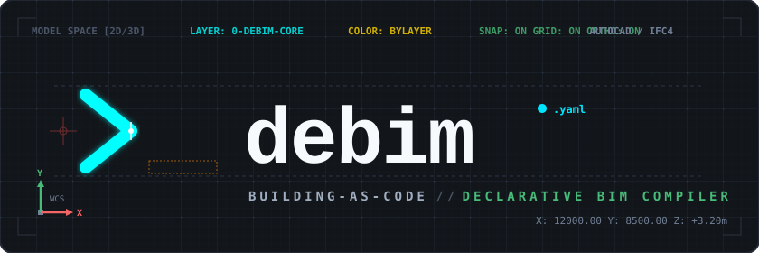
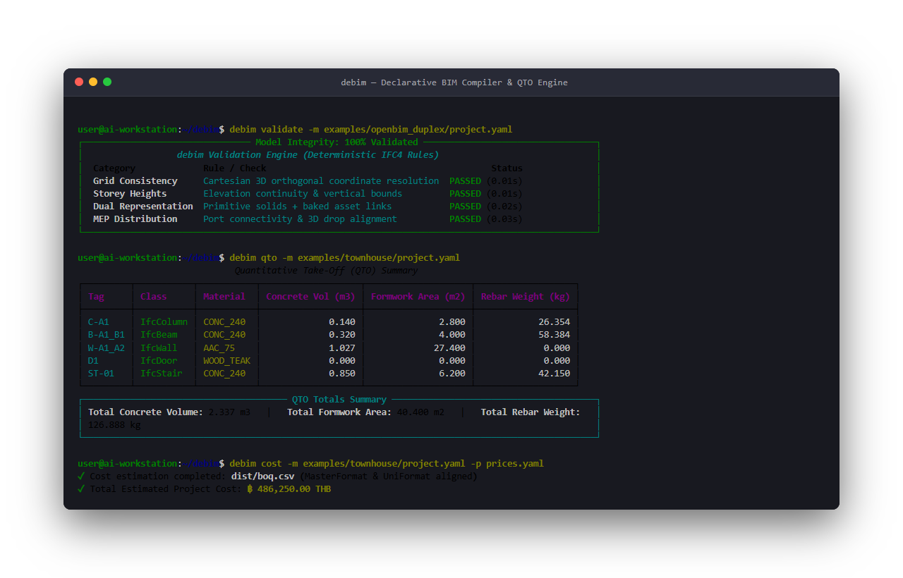
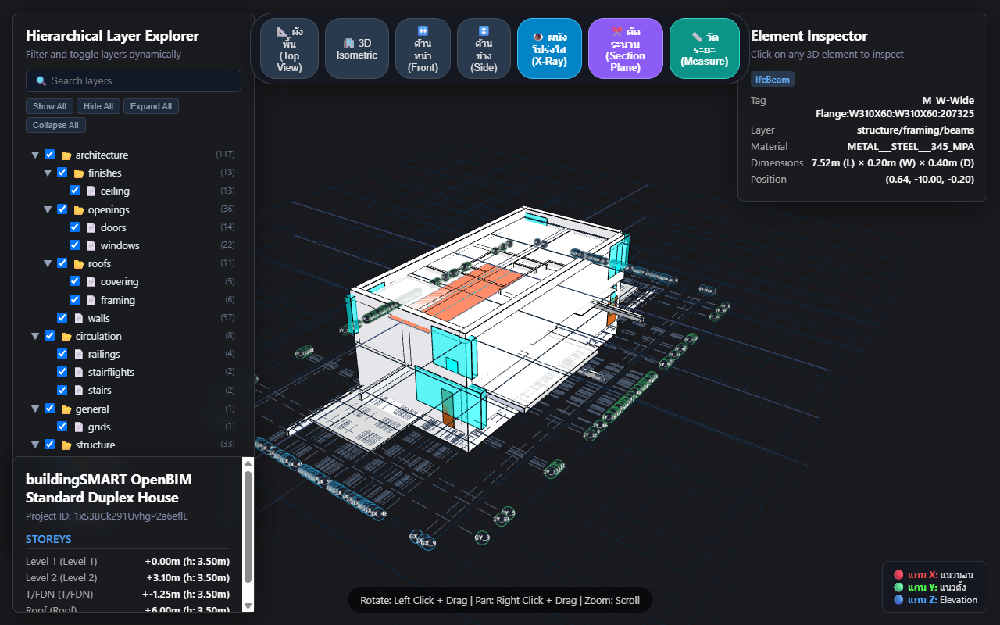

<p align="center">
  
</p>

<p align="center">
  <strong>A minimal, Git-native, declarative BIM engine & Model Context Protocol (MCP) Server for AI agents and humans.</strong>
</p>

<p align="center">
  <a href="https://pypi.org/project/debim/"></a>
  <a href="#-model-context-protocol-mcp-server"></a>
  <a href="https://opensource.org/licenses/MIT"></a>
  <a href="https://www.python.org/downloads/"></a>
  <a href="https://technical.buildingsmart.org/"></a>
  <a href="tests/"></a>
  <a href="https://www.kaggle.com/code/pridatakon/debim-3d-visual-balanced-benchmark"></a>
  <a href="https://prida-takon.github.io/debim/"></a>
</p>

<p align="center">
  <a href="https://prida-takon.github.io/debim/">
    
  </a>
</p>

---

<p align="center">
  <table width="100%">
    <tr>
      <td width="50%" align="center" valign="top">
        <b>💻 Modern CLI, QTO & Costing Engine</b><br>
        
      </td>
      <td width="50%" align="center" valign="top">
        <b>🌐 Zero-Install 3D Web Viewer (<a href="https://prida-takon.github.io/debim/">Try Live Demo</a>)</b><br>
        <a href="https://prida-takon.github.io/debim/"></a>
      </td>
    </tr>
  </table>
  <sub>🏛️ <i>Showcase: Ludwig Mies van der Rohe's iconic <b>Farnsworth House (1951)</b> — compiled from declarative YAML (<a href="examples/farnsworth_house/project.yaml">examples/farnsworth_house/project.yaml</a>) into standard IFC4 and rendered in real-time in a lightweight 3D web viewer.</i></sub>
</p>

> [!TIP]
> **🤖 Authored 100% by AI Agent (Antigravity powered by Gemini 3.8 Flash):**  
> This iconic architectural masterpiece was **not coded by hand line-by-line!** Instead, an **autonomous AI Coding Agent (Google Antigravity powered by Gemini 3.8 Flash)** researched historical blueprints, structural grids, and architectural dimensions of the Farnsworth House, synthesized the declarative YAML specification (`project.yaml`), computed material quantities (QTO), and compiled standard IFC4 building models in seconds — proving that **humans don't need to manually code YAML when assisted by AI agents!**

---

## 🎯 Why debim?

> *"debim originated from a simple desire: to make AI calculate accurate Bills of Quantities (BOQ). Asking an LLM to guess building dimensions directly in text leads to fatal hallucinations. An exact mathematical model (BIM) is essential, yet traditional IFC files are bloated and overwhelm AI context windows. The solution is Declarative YAML — but the resulting Building-as-Code engine proved far more transformative than our initial goal."*

Traditional BIM tools (like Revit or Archicad) were conceived over 25 years ago for humans clicking with computer mice. They lock architectural data inside heavy, proprietary gigabyte files (`.rvt`), charge thousands of dollars in annual licenses, and remain completely opaque to modern automation and AI agents.

**debim** is built on **5 Core Architectural Tenets**:
1. **Building-as-Code & Git-Native:** Buildings are software. Expressed as compact YAML (Kilobytes, not Gigabytes) for transparent Version Control, line-by-line Git diffs, and branching.
2. **Deterministic Code Compliance:** Building codes and engineering regulations are treated as automated Unit Tests (`pytest`), catching setback violations and structural errors in 0.01 seconds before ground is broken.
3. **Zero-License & Zero-Friction Visualization:** Instant geometric verification through lightweight 3D HTML viewers that load in any browser or mobile device in 2 seconds without expensive licenses.
4. **Universal Bridge & Dual Representation:** Seamlessly connects 2D drafts, 3D DCC tools (Blender/SketchUp), and open IFC standards using a dual approach: 90% geometric primitives for engineering/BOQ + 10% baked GLB assets for architectural refinement.
5. **Human & AI Super-Collaboration:** Designed with explicit uncertainty flags (`review_status: needs_review`), enabling humans and autonomous AI agents to co-author and verify building models without friction.

---

## 🤖 Autonomous AI-Agent Setup

If you use an AI coding assistant (like **Antigravity, Cursor, Claude Code, Jules, or ChatGPT/Copilot**), you don't even need to install it manually!

Just copy and send this prompt to your AI:

> *"Please read https://github.com/PRIDA-TAKON/debim and `AGENTS.md`, install debim in my environment, and run `debim --help` to verify."*

Your agent will inspect the repository, install the dependencies, and verify everything automatically.

---

## 🔌 Model Context Protocol (MCP) Server

`debim` natively implements the official **[Model Context Protocol (MCP)](https://modelcontextprotocol.io/)** via `FastMCP` (Python SDK). It provides LLMs and AI Agents (such as Claude Desktop, Cursor, Cline, Windsurf, Devin, and Antigravity) with deterministic tools to model, inspect, calculate, compile, and visualize buildings directly via function calling.

### Connecting to Claude Desktop / Cursor / Cline

Add `debim` to your MCP configuration (`claude_desktop_config.json` or `.cursor/mcp.json`):

```json
{
  "mcpServers": {
    "debim": {
      "command": "debim",
      "args": ["mcp"]
    }
  }
}
```

Or run via Docker:

```json
{
  "mcpServers": {
    "debim": {
      "command": "docker",
      "args": ["run", "-i", "--rm", "ghcr.io/prida-takon/debim:latest"]
    }
  }
}
```

### Exposed MCP Tools

| MCP Tool | Description | Input Parameters |
|---|---|---|
| `debim_validate` | Validates YAML manifest syntax, structural grid alignments, storey heights, and material references. | `manifest_yaml: str` |
| `debim_qto` | Computes deterministic Quantitative Take-Off (concrete vol, formwork area, rebar kg, structural steel, timber, masonry). | `manifest_yaml: str` |
| `debim_cost_template` | Extracts materials used by the building model and generates a minimal project-scoped price catalog template. | `manifest_yaml: str` |
| `debim_cost` | Maps QTO quantities against unit prices, calculates total project cost, and optionally exports BOQ to CSV. | `manifest_yaml: str`, `prices_yaml?: str`, `export_csv_path?: str` |
| `debim_compile_ifc` | Compiles declarative YAML into an open, standardized buildingSMART IFC4 model (`.ifc`). | `manifest_yaml: str`, `output_ifc_path: str` |
| `debim_generate_viewer` | Generates a standalone, zero-dependency interactive 3D WebGL HTML viewer with section cut and layer tree. | `manifest_yaml: str`, `output_html_path: str` |

### Running the MCP Server Locally

```bash
# Start MCP server over stdio
debim mcp
```

---

## 🚀 Quickstart
 
### 1. Installation

Install directly from **[PyPI](https://pypi.org/project/debim/)**:

```bash
# Standard installation
pip install debim

# Or with full IFC compiler support
pip install "debim[ifc]"
```

Or install in editable mode from source:

```bash
git clone https://github.com/PRIDA-TAKON/debim.git
cd debim
pip install -e ".[ifc,dev]"
```

### 2. Basic Commands

```bash
# Initialize a new project
debim init my-project

# Validate schema syntax & grid references
debim validate -m examples/farnsworth_house/project.yaml

# Run automated building code compliance checks (pytest)
debim test

# Calculate Quantitative Take-Off (Steel weight, stone volume, glass area)
debim qto -m examples/farnsworth_house/project.yaml

# Generate project-scoped price template with international classifications
debim cost template -m examples/farnsworth_house/project.yaml -o prices.template.yaml

# Estimate project budget & export BOQ to CSV
debim cost -m examples/farnsworth_house/project.yaml -p examples/farnsworth_house/prices.yaml -o dist/boq.csv

# Scaffold a new BIM element class boilerplate
debim scaffold element IfcRailing

# Preview 3D model in your browser (Three.js with Hierarchical Layer Explorer)
debim view -m examples/farnsworth_house/project.yaml

# Compile declarative YAML to standard IFC4 building model
debim compile -m examples/farnsworth_house/project.yaml -o dist/farnsworth_house.ifc

# Launch Model Context Protocol (MCP) server over stdio
debim mcp
```

---

## 🏗️ Example `project.yaml`

```yaml
schema: IFC4-Minimal
project:
  id: PRJ-2026-001
  name: "Townhouse-Feasibility"
  units: { length: METER, area: SQUARE_METER, volume: CUBIC_METER }

# 1. Spatial Structure
spatial_structure:
  storeys:
    - id: L1
      name: "Level 1"
      elevation: 0.00
      height: 3.50
    - id: L2
      name: "Level 2"
      elevation: 3.50
      height: 3.20

# 2. Reference Grid Axes
grids:
  axes_x: { A: 0.00, B: 4.00, C: 8.00 }
  axes_y: { 1: 0.00, 2: 5.00, 3: 10.00 }

# 3. Materials
materials:
  - id: CONC_240
    name: "Concrete 240 ksc"
    category: concrete
    unit_cost_ref: "MAT-CONC-01"
  - id: AAC_75
    name: "AAC Block 7.5cm"
    category: masonry
    unit_cost_ref: "MAT-AAC-01"

# 4. Elements
elements:
  # Column placed at grid intersection [A, 1]
  - class: IfcColumn
    tag: C-A1
    material: CONC_240
    profile: { shape: BOX, width: 0.20, depth: 0.20 }
    placement:
      grid: [A, 1]
      base_storey: L1
      top_storey: L2
    reinforcement:
      main: "4-DB16"
      stirrups: "RB6 @ 0.15m"

  # Beam spanning between [A, 1] and [B, 1]
  - class: IfcBeam
    tag: B-A1_B1
    material: CONC_240
    profile: { shape: BOX, width: 0.20, depth: 0.40 }
    placement:
      from_grid: [A, 1]
      to_grid: [B, 1]
      storey: L2
    reinforcement:
      main_top: "2-DB16"
      main_bottom: "3-DB20"
      stirrups: "RB9 @ 0.15m"

  # Wall with door host-child relationship
  - class: IfcWall
    tag: W-A1_A2
    material: AAC_75
    thickness: 0.075
    height: 3.10
    placement:
      from_grid: [A, 1]
      to_grid: [A, 2]
      storey: L1
    children:
      - class: IfcDoor
        tag: D1
        dimensions: { width: 0.90, height: 2.00 }
        offset_distance: 1.20
```

---

## 🔬 Empirical Research & Benchmark
 
debim prioritizes engineering precision and reproducible open science on our **Kaggle Cloud Multi-Core Benchmark Suite**:
 
### 1. ⚖️ 3D Visual Regression & Alignment Benchmark (255 Real-World Buildings)
 
<p align="center">
  <a href="https://www.kaggle.com/code/pridatakon/debim-3d-visual-balanced-benchmark">
    
  </a>
</p>
 
Evaluating blind 3D geometric fidelity against ground-truth IFC models using **Geometry Variant Deduplication + Balanced Macro-Averaging** across 4,695 representative building elements:
 
- **🎯 85.50% Median Visual Fidelity:** Surpassing the international standard benchmark ($\ge 85\%$) across the majority of test suites.
- **🏗️ 89.07% Structural Match:** Primary load-bearing elements (columns, beams, slabs, foundations) maintain Grade-A+ geometric alignment.
- **⚡ 82.64% MEP System Match:** Ductwork, drainage, piping, and electrical fixtures align accurately in 3D coordinate planes.
 
#### 📈 Progression Across Waves:
 
| Global Metric | V1 (Baseline) | V2 (Wave 1-2) | V3 (Latest Wave 4) | Cumulative Improvement |
|---|:---:|:---:|:---:|:---:|
| **🎯 Median Visual Match** | 80.90% | 84.90% | **85.50%** | 🏆 **+4.60% (Exceeded 85%)** |
| **⚖️ Macro Average Visual Match** | 70.57% | 77.60% | **77.71%** | 🟢 **+7.13%** |
| **📊 Micro Average Visual Match** | 72.24% | 80.35% | **80.46%** | 🟢 **+8.23%** |
| **Passing Elements ($\ge 85\%$)** | 2,865 | 3,140 | **3,135** | 🟢 **+270 elements** |
| **Top Performing Disciplines** | | | | |
| • *Ceilings (`IfcCovering`)* | 11.4% | 89.0% | **89.0%** | 🟢 **+77.6% (Passing)** |
| • *Valves & Piping (`IfcValve`)* | 0.0% | 82.2% | **82.4%** | 🟢 **+82.4% (Zero-shot lift)** |
| • *Structural Plates (`IfcPlate`)* | 10.2% | 88.9% | **87.1%** | 🟢 **+76.9% (Passing)** |
| • *Bracing Members (`IfcMember`)* | 91.8% | 91.6% | **92.4%** | 🟢 **+0.8% (3D Vector Pitch)** |
 
👉 *Want to inspect raw visual data or reproduce tests yourself? Explore the full dataset and code on the [Kaggle Benchmark Notebook](https://www.kaggle.com/code/pridatakon/debim-3d-visual-balanced-benchmark).*
 
---
 
### 2. 📦 Roundtrip Retention & Storage Reduction Study (407 Real-World OpenBIM Models)
 
Rigorously benchmarked against **407 real-world projects** across architectural, structural, and complex hospital MEP domains:
 
- **100.0% Median Retention Rate:** Extract and re-compile back to standard IFC4 without element loss.
- **91.6% Average Storage Reduction:** Compresses raw IFC files by an average of 91%.
- **558M+ LLM Tokens Saved:** Prevented **558,629,804 tokens** from cluttering agent context windows.
- **100.0% Modern Schema Crash-Resilience:** Zero fatal crashes or unhandled exceptions across standard IFC2X3 and IFC4 datasets.
 
📖 **Read Full Research Paper:** [debim: An Empirical Study of Declarative Building-as-Code on 407 Heterogeneous Real-World OpenBIM Models](docs/research/2026_empirical_study_407_ifc_models.md)  
📦 **Kaggle Public Benchmark Dataset:** [debim-5000-ifc-benchmark](https://www.kaggle.com/datasets/pridatakon/debim-5000-ifc-benchmark)  
⚡ **Kaggle Automated Stress Test:** [debim-ifc-stress-test](https://www.kaggle.com/code/pridatakon/debim-ifc-stress-test)

---

## ❓ Frequently Asked Questions (FAQ)

<details>
<summary><b>Why YAML instead of JSON, Python, or Excel?</b></summary>
<br>
YAML is clean, concise, supports nested hierarchies, and allows comments (essential for architectural notes). Unlike JSON, it has no noisy braces. Unlike Excel, it is 100% Git-friendly, diffable, and conflict-resolvable. It serves as a pure declarative DSL (Domain-Specific Language)—just like Kubernetes, Docker Compose, and GitHub Actions.
</details>

<details>
<summary><b>How do I place off-grid items (internal partitions, cantilever beams)?</b></summary>
<br>
Use relative offsets: `placement: { grid: [A, 1], offset: [1.20, 0.50] }`. Just like pulling a tape measure on site from the nearest grid line.
</details>

<details>
<summary><b>Does this replace Revit or AutoCAD?</b></summary>
<br>
No, it complements them. debim handles the early-stage upstream workload: rapid feasibility, parametric sizing, AI generation, instant QTO/costing, and automated building law validation. Once validated, run <code>debim compile</code> to export standard IFC4 and load it directly into BlenderBIM, FreeCAD, or Revit for 2D drafting and detail annotations.
</details>

---

## 📄 License & Attribution

- **Software Code:** Licensed under the [MIT License](LICENSE) — Copyright (c) 2026 Prida Takon.
- **Research & Technical Reports:** Licensed under [Creative Commons Attribution 4.0 International (CC BY 4.0)](https://creativecommons.org/licenses/by/4.0/).
- **Benchmark Datasets & Sample Models:** Test fixtures in `tests/fixtures/` originate from [buildingSMART International](https://github.com/buildingSMART) and the Open IFC Model Repository under CC BY 4.0 / CC-BY-3.0.
