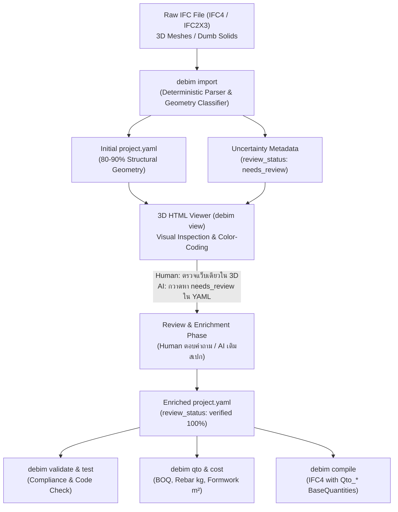
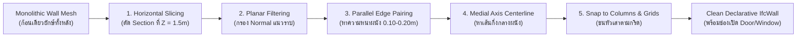
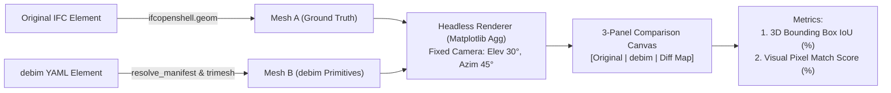

# Architectural Blueprint: IFC Reverse-Engineering & Human/AI-in-the-Loop Workflow

> **สถานะเอกสาร:** RFC / Design & Development Roadmap  
> **หมวดหมู่:** Architecture, IFC Interoperability, Human/AI-in-the-Loop Engineering, 3D Visualization  
> **เป้าหมาย:** พัฒนากระบวนการแปลงไฟล์ IFC (รวมถึง 3D Dumb Meshes) สู่ Declarative YAML (`project.yaml`) ให้มีความแม่นยำสูงสุด ลดความคลาดเคลื่อนทางเรขาคณิต พร้อมระบบ Visual Inspection ผ่าน 3D HTML Viewer และ Explicit Uncertainty Schema สำหรับ Human/AI-in-the-Loop

---

## 1. บทนำและปัญหาหลักของอุตสาหกรรม (The Industry Reality)

### 1.1 มายาคติ "BIM = แค่ปั้นโมเดล 3 มิติ" (Dumb 3D Meshes)
ในอุตสาหกรรมก่อสร้างจริง โมเดล IFC มากกว่า 70-80% ที่ได้รับจากสถาปนิกหรือส่งต่อมาจากซอฟต์แวร์ เช่น SketchUp, Rhino, Blender หรือ Revit ที่ไม่ได้ตั้งค่า Parameter เป็นเพียง **"Dumb 3D Meshes"**:
- **ขาด BaseQuantities (`Qto_*`):** ไม่มีข้อมูลปริมาตรสุทธิ, พื้นที่ผิว, หรือความยาวจริงที่ผ่านการตัดรอยต่อ
- **ไม่มีข้อมูลเหล็กเสริม (Rebar):** เนื่องจากไม่มีใครใส่โมเดล 3D เหล็กเสริมทั้งหลังเพราะไฟล์จะหนักเกินไป
- **ไม่มีข้อมูลไม้แบบ (Formwork):** ไม่มีเลเยอร์หรือพื้นผิวสำหรับคำนวณไม้แบบ
- **ชิ้นส่วนทับซ้อนกัน (Clashes & Overlaps):** เสา-คาน-พื้น ชนกันในพิกัดเดียวกัน หากใช้โปรแกรมถอดแบบทั่วไปจะเกิดปัญหา Double Counting ทำให้ปริมาตรคอนกรีตเกินจริงทันที

### 1.2 เปรียบเทียบ: 2D Drawing vs IFC 3D Dumb Mesh
ทำไมการเริ่มจาก **IFC 3D Mesh** จึงได้ผลลัพธ์ที่ผิดพลาดน้อยกว่าการอ่านจาก **2D Drawing** มาก?

| มิติการวิเคราะห์ | 2D Drawing (CAD / PDF / ภาพแปลน) | IFC 3D Model (แม้เป็น Dumb Mesh) |
|---|---|---|
| **ความกำกวม (Ambiguity)** | **สูงมาก:** เส้นทับซ้อน, Dimension OCR อ่านผิด, ขาดแกน Z (ความสูง), ต้องเปิดเทียบหลายแผ่น | **แทบไม่มี:** พิกัด $(X, Y, Z)$ ใน 3D Space เป็นตัวเลข Floating-point ทางคณิตศาสตร์ที่แน่นอน |
| **การระบุประเภทชิ้นงาน** | ต้องพึ่งพา Multimodal AI ในการตีความสัญลักษณ์ (C1, B1, D1) | จำแนกได้จาก Aspect Ratio ของ Bounding Box ทางเรขาคณิต (สูงตั้ง = เสา, แนวนอนยาว = คาน, แผ่นนอน = พื้น) |
| **ความคลาดเคลื่อนของข้อมูล** | ขึ้นอยู่กับสายตาและความสามารถของ AI Model | **ต่ำมาก** เพราะเป็นการคำนวณเวกเตอร์พิกัดตรงไปตรงมา |

---

## 2. Positioning ทางกลยุทธ์: ทำไมต้องมี Declarative YAML ในยุคที่ AI เข้าไปเขียน BIM ได้?

หากในอนาคต AI Agent มีความสามารถเข้าไปสั่งการหรือเขียนโมเดลในซอฟต์แวร์ BIM ขนาดใหญ่ (Revit, ArchiCAD, BlenderBIM) ได้โดยตรง คำถามเชิงยุทธศาสตร์คือ **"ทำไมเรายังต้องมี Declarative YAML และ debim?"**

### 2.1 YAML คือ "สมองและพิมพ์เขียว (Single Source of Truth)" สำหรับ AI
1. **Token & Context Efficiency มหาศาล:**
   - ไฟล์โปรเจกต์ Revit/ArchiCAD มีขนาด 200MB – 1GB เต็มไปด้วย Binary database ซับซ้อน AI ไม่สามารถโหลดทั้งก้อนเข้า Context Window ได้
   - แต่ `project.yaml` มีขนาดเพียง **20–50 KB** AI Agent สามารถอ่านและเข้าใจตรรกะอาคารทั้งหลังได้ใน 1 วินาที ใช้ Token เพียงไม่กี่พัน
2. **Headless Execution & Feasibility:**
   - การประเมิน Feasibility 10 แบบทางเลือก หรือเช็คกฎหมายอาคาร (Building Code Compliance):
     - รันผ่านโปรแกรม BIM ยักษ์ใหญ่: ใช้เวลาเป็นชั่วโมง, กินแรม 32GB, และเสียค่า License มหาศาล
     - รันผ่าน debim YAML บน Cloud/CI-CD: จบใน **0.05 วินาที** ได้ตาราง BOQ ออกมาทันที
3. **YAML เป็น Controller ไม่ใช่ศัตรูของ BIM Software:**
   - หาก Agent ต้องไปสั่งสร้างโมเดลใน Revit หรือ FreeCAD จริง สิ่งที่ Agent ใช้เป็น **Input สั่งงาน** ก็คือไฟล์ YAML นี้เอง

### 2.2 บทบาทที่แท้จริงของการแปลง `YAML -> IFC`
* **ไม่ใช่โปรแกรมแข่งปั้น 3D วิจิตรพิสดาร:** เป้าหมายของ debim คือ **Engineering & Cost Logic Engine**
* **IFC เป็น "Handover Adapter / Legal Deliverable":** หน่วยงานรัฐ (เช่น กรมโยธาฯ, กทม. e-Permit) และผู้รับเหมาต้องการไฟล์ส่งมอบเป็น OpenBIM IFC มาตรฐาน ดังนั้น `YAML -> IFC` ทำหน้าที่เป็น Compiler พ่น Snapshot มาตรฐานที่มี `Qto_*` ครบถ้วนตามกฎหมายกำหนด

---

## 3. สถาปัตยกรรม Human/AI-in-the-Loop Workflow



---

## 4. ข้อกำหนดการออกแบบเชิงเทคนิค (Technical Specifications)

### 4.1 Explicit Uncertainty Representation ใน Schema (`review_status`)
เพื่อไม่ให้ข้อมูลที่เกิดจากการเดา (Default / Heuristic) ปะปนกับข้อมูลที่ยืนยันแล้ว องค์อาคารทุกตัวใน Schema จะรองรับฟิลด์ Review Metadata:

```yaml
elements:
  - class: IfcColumn
    tag: COL-05
    # -------------------------------------------------------------
    # Explicit Uncertainty Metadata
    review_status: needs_review    # [verified | needs_review | draft]
    review_notes: "Auto-classified from Proxy; default rebar 4-DB16 applied"
    # -------------------------------------------------------------
    material: CONC_280
    profile:
      shape: BOX
      width: 0.30
      depth: 0.30
    placement:
      grid: [B, 2]
      base_storey: L1
      top_storey: L1
```

#### ประโยชน์ต่อ AI Agent:
* AI สามารถเขียนสคริปต์กวาดหาชิ้นส่วนที่มี `review_status: needs_review`
* แปลงเป็นคำถามที่กระชับถามผู้ใช้ผ่าน Interactive Tooling เช่น:
  > *"พบเสา 6 ต้น (COL-01 ถึง COL-06) ที่นำเข้าจาก IFC ไม่มีสเปกเหล็กเสริม ปัจจุบันใช้ค่ามาตรฐาน 4-DB16 ต้องการยืนยันสเปกนี้หรือไม่?"*
* เมื่อผู้ใช้ยืนยัน Agent จะปรับเป็น `review_status: verified`

---

### 4.2 ระบบตรวจสอบด้วยสายตาผ่าน 3D HTML Viewer (`debim view`)
มนุษย์สามารถตรวจความผิดพลาดทางเรขาคณิต (เสาหาย, ผนังลอย, คานทะลุ) ได้เร็วกว่าการอ่านตัวเลขใน YAML หลายเท่า ผ่าน 3D Web Viewer:

#### 1. Color-Coding ตามระดับความมั่นใจ (Confidence & Review Status):
* 🟢 **เขียว / สีวัสดุปกติ:** สถานะ `verified` ข้อมูลครบถ้วน มั่นใจ 100%
* 🟠 **สีส้ม / Amber:** สถานะ `needs_review` (เช่น ใช้ Default Rebar, Default Material หรือแปลงมาจาก Proxy)
* 🔴 **สีแดง / ไฮไลต์กะพริบ:** มีความขัดแย้งเชิงเรขาคณิต (Clash, Floating Element, Unconnected Wall)

#### 2. Inspector Panel & Quick Review Action:
* เมื่อคลิกที่ชิ้นงาน 3D ในเบราว์เซอร์:
  * แสดงแถบ Inspector ด้านข้าง: Tag, Storey, Dimensions, Material, Rebar
  * แสดง `review_notes` และสาเหตุที่ติดสถานะ `needs_review`
  * ปุ่ม **"Mark as Verified"** เพื่ออัปเดตไฟล์ YAML ทันที
  * ปุ่ม **"Copy YAML Snippet"** สำหรับนำไปเปิดแก้ใน Editor

---

### 4.3 การสกัดแนวกริดแท้จริงจาก `IfcGrid` (Native Grid Preservation)
* ค้นหา Entity `IfcGrid` ในไฟล์ IFC ดึงรายชื่อ `UAxes` และ `VAxes` พร้อมพิกัดจริง
* นำชื่อกริดจริงตามแบบ (เช่น กริด `1, 2, 3` และ `A, B, C`) มาใช้แทนการสุ่มชื่อจำลอง `GX_1, GY_1`
* ช่วยให้ทั้งมนุษย์และ AI เทียบเคียงโมเดลกับแบบ 2D หรือ Drawing ได้ตรงกันทันที

### 4.4 การจำแนกประเภท Dumb Proxy ด้วยรูปทรง (Geometric Classifier)
กรณีไฟล์ IFC Export มาจากโปรแกรมที่แปลงทุกอย่างเป็น `IfcBuildingElementProxy`:
* คำนวณ Bounding Box Dimensions $(W_x, D_y, H_z)$:
  * **Column:** $H_z \ge 2.0\text{ m}$ และ $W_x, D_y \le 0.8\text{ m}$ (แท่งตั้งยาว) $\rightarrow$ ตั้ง `review_status: needs_review`
  * **Beam:** ความยาวแนวนอน $\gg H_z$ และอยู่บริเวณใต้พื้น $\rightarrow$ ตั้ง `review_status: needs_review`
  * **Slab:** แผ่นแนวนอน $H_z \le 0.35\text{ m}$ และพื้นที่ $W_x \times D_y \ge 1.0\text{ m}^2$
  * **Wall:** แผ่นแนวตั้ง $H_z \ge 2.0\text{ m}$ และความหนา $\le 0.4\text{ m}$

---

### 4.5 กลยุทธ์เชื่อมโยงกลุ่มผู้ใช้ SketchUp & Blender (Direct Ingestion & Asset Baking)
ผู้ใช้ในตลาดกว่า 70-80% ปั้นโมเดลใน SketchUp หรือ Blender เป็นหลักเพราะยืดหยุ่นและรวดเร็ว แต่ประสบปัญหาไม่สามารถนำมาทำ BIM หรือถอด BOQ ได้ debim จึงวาง 3 กลไกสนับสนุน:
1. **Direct Ingestion จาก IFC Proxy:** คนปั้นใน SketchUp กด Export IFC ตามปกติ แล้วให้ debim Classifier สแกนแยกองค์อาคารอัตโนมัติ
2. **Asset Baking (Dual Representation ไม่ทิ้งความละเอียด):** ชิ้นงานตกแต่งที่ปั้นมาอย่างประณีต (เฟอร์นิเจอร์บิวท์อิน, ซุ้มบัว, บันไดวน) จะถูกสกัดเป็น binary `.glb` เก็บไว้ใน `assets/furniture/*.glb` ทำให้ 3D HTML Viewer สวยงามเหมือนใน SketchUp แต่ได้ BOQ และ Engineering YAML ครบถ้วน
3. **อนาคต: Direct `.glb` / `.obj` Importer:** รองรับการดึงไฟล์ GLB จาก SketchUp/Blender โดยตรงโดยไม่ต้องแปลงเป็น IFC ก่อน

---

### 4.6 การรับมือปัญหา "ผนังก้อนเดียวติดกันทั้งอาคาร" (Monolithic Wall Mesh Decomposition)
หนึ่งในเคสฝันร้ายที่พบบ่อยที่สุดจาก SketchUp คือ **"คนเขียนแบบดึงผนัง (Push/Pull) เชื่อมกันทั้งบ้านเป็น Mesh ก้อนเดียว"** ทำให้ Bounding Box มีขนาดเท่ากับอาคารทั้งหลัง $(20\text{m} \times 15\text{m})$ และไม่สามารถระบุเป็นผนังเดี่ยวได้

> **หลักการแก้ปัญหาของ debim:**  
> **"อย่าพยายามตัดแบ่ง Mesh ก้อนเดิมให้ซับซ้อน — แต่ให้สกัดระนาบแนวตั้ง (Vertical Planar Features) และแกนกลาง (Centerline) แล้วสร้าง `IfcWall` ใหม่แบบ Declarative ขึ้นมาแทนที่!"**



#### ขั้นตอนวิธี (5-Step Reconstruction Algorithm):
1. **Horizontal Section Slicing:** ตัด Section แนวนอนผ่านตัวอาคารที่ระดับ $Z = 1.5\text{ m}$ (เพื่อเลี่ยงระดับพื้นและท้องคาน) จะได้กลุ่มเส้นขอบ 2D ของผนังทั้งหมด
2. **Vertical Face Normal Filtering:** คัดเลือกเฉพาะผิวที่มี Normal Vector ขนานกับแนวราบ ($N_z \approx 0$)
3. **Parallel Edge Matching:** จับคู่เส้นขอบที่ขนานกันและมีระยะห่างตรงกับมาตรฐานความหนาผนัง (เช่น $0.10\text{ m}$ สำหรับอิฐมอญ/มวลเบา, $0.15\text{ m}$ สำหรับผนังฉาบสองด้าน)
4. **Centerline & Column Snapping:** คำนวณเส้นแกนกลาง (Centerline) ระหว่างคู่ขนาน แล้วดึงจุดปลายเส้นเข้าหาพิกัดเสาและแนวกริดที่สกัดไว้ก่อนหน้า
5. **Reconstruct as Declarative `IfcWall`:** แปลงผลลัพธ์เป็น `IfcWall(from_grid=..., to_grid=..., thickness=..., height=...)` พร้อมระบุช่องว่าง (Voids) สำหรับ `IfcDoor` และ `IfcWindow` ที่เจาะอยู่บนแนวนั้น

---

### 4.7 ระบบทดสอบภาพเรขาคณิตสามมิติรายชิ้นงาน (Component-Level 3D Visual Regression)
ป้องกันกรณีที่ **"โค้ด YAML ถูกต้อง แต่แสดงผลสามมิติหรือหมุนองศาผิดพลาด"** โดยไม่ให้เปลือกอาคารภายนอกมาบังชิ้นส่วนภายใน:



#### ประโยชน์และผลการทดสอบจริง:
1. **Isolated Component Comparison:** สกัดเฉพาะชิ้นงานเดี่ยวๆ (เสา คาน ผนัง ประตู ฐานราก) ออกมาหมุนเรนเดอร์ในกรอบพิกัดเฉพาะ ทำให้เห็นข้อผิดพลาดระดับองศา (เช่น องศาแนวคานกลับทิศ) ที่การตรวจดูแบบรวมทั้งหลังมองไม่เห็น
2. **Deterministic & Fast:** รันเรนเดอร์และประมวลผลความต่างระดับพิกเซลจบใน **0.5 วินาทีต่อชิ้นส่วน** บน CPU ธรรมดา ไม่ต้องพึ่งพา GPU
3. **Kaggle-Ready Batch Verification:** สคริปต์ถูกออกแบบให้รันแบบ Headless บน Kaggle ร่วมกับชุดโมเดลนับร้อยไฟล์ได้ทันที (`tools/render_visual_regression.py`)

---

## 5. แผนงานการพัฒนา (Milestones & Action Items)

- [x] **Milestone 0: Component-Level 3D Visual Regression Tool (`tools/render_visual_regression.py`)**
  - เครื่องมือเรนเดอร์ 3-Panel Diff Map พร้อมคิด 3D IoU และ Pixel Match Score ระดับรายชิ้นงาน
- [ ] **Milestone 1: Uncertainty Schema & Native Grid Extraction**
  - เพิ่มฟิลด์ `review_status` และ `review_notes` ใน Pydantic Element Schema (`schema.py`)
  - Implement `IfcGrid` parser ใน `importer.py` เพื่อดึงชื่อกริดจริง
- [ ] **Milestone 2: 3D HTML Viewer Visual Audit Mode**
  - อัปเกรด `viewer.py` ให้รองรับการเรนเดอร์สีแบบ Color-Coded ตาม `review_status`
  - เพิ่มแถบ Inspector Tooltip แสดงข้อความ Review Notes และปุ่มคลิกตรวจ
- [ ] **Milestone 3: Intelligent Geometric Classifier for Proxies**
  - เพิ่ม Rule-based Classifier สำหรับแยกประเภท Dumb Solid / Proxy ให้กลายเป็น Column, Beam, Wall, Slab พร้อมติดแท็ก `needs_review`
- [ ] **Milestone 4: Monolithic Wall Planar Slicer & Reconstructor**
  - เพิ่มอัลกอริทึมตัด Slice ระนาบแนวตั้ง เพื่อแกะผนังที่หลอมติดกันทั้งหลังให้ออกมาเป็น `IfcWall` แยกชิ้นที่ชนกับหัวเสา
- [ ] **Milestone 5: IFC4 BaseQuantities & Pset Compiler**
  - อัปเกรด `compiler.py` ให้คำนวณและ Embed `Qto_*BaseQuantities` ลงในไฟล์ IFC ที่ส่งออก
- [ ] **Milestone 6: Cloud Batch Visual Regression on Kaggle**
  - ปลั๊ก `render_visual_regression.py` เข้ากับ Kaggle Stress Test Notebook เพื่อรันประเมิน Visual Fidelity ทั่วทั้ง Dataset หลายร้อยโมเดลแบบอัตโนมัติ

