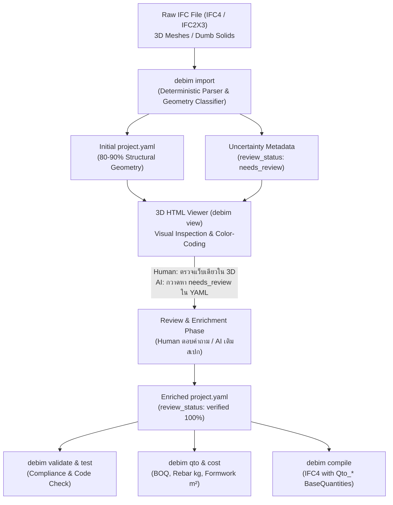
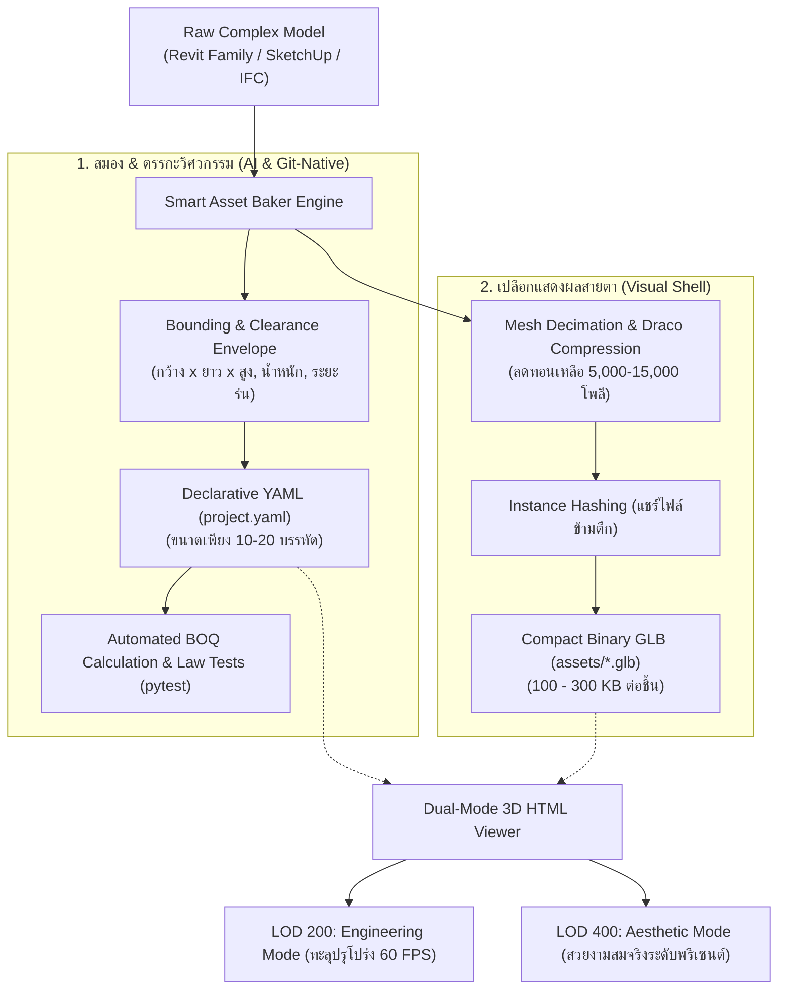
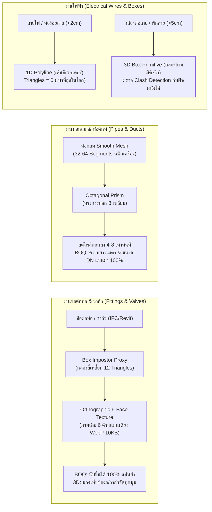
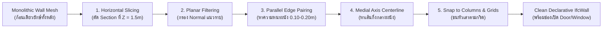
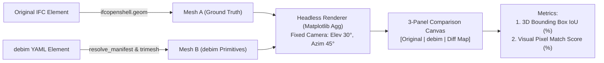
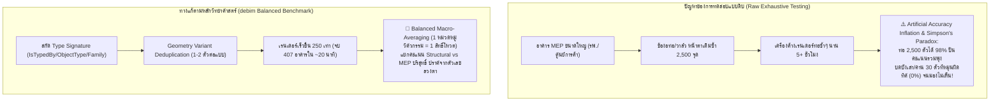

# Architectural Blueprint: IFC Reverse-Engineering & Human/AI-in-the-Loop Workflow

> **สถานะเอกสาร:** RFC / Design & Development Roadmap  
> **หมวดหมู่:** Architecture, IFC Interoperability, Human/AI-in-the-Loop Engineering, 3D Visualization  
> **เป้าหมาย:** พัฒนากระบวนการแปลงไฟล์ IFC (รวมถึง 3D Dumb Meshes) สู่ Declarative YAML (`project.yaml`) ให้มีความแม่นยำสูงสุด ลดความคลาดเคลื่อนทางเรขาคณิต พร้อมระบบ Visual Inspection ผ่าน 3D HTML Viewer และ Explicit Uncertainty Schema สำหรับ Human/AI-in-the-Loop

---

## 1. บทนำและปัญหาหลักของอุตสาหกรรม (The Industry Reality)

### 1.1 มายาคติ "BIM = แค่ปั้นโมเดล 3 มิติ" (Dumb 3D Meshes)
ในอุตสาหกรรมก่อสร้างจริง โมเดล IFC มากกว่า 70-80% ที่ได้รับจากสถาปนิกหรือส่งต่อมาจากซอฟต์แวร์ เช่น SketchUp, Rhino, Blender หรือ Revit ที่ไม่ได้ตั้งค่า Parameter เป็นเพียง **"Dumb 3D Meshes"**:
- **ขาด BaseQuantities (`Qto_*`):** ไม่มีข้อมูลปริมาตรสุทธิ, พื้นที่ผิว, หรือความยาวจริงที่ผ่านการตัดรอยต่อ
- **ไม่มีข้อมูลเหล็กเสริม (Rebar):** เนื่องจากไม่มีใครใส่โมเดล 3D เหล็กเสริมทั้งหลังเพราะไฟล์จะหนักเกินไป
- **ไม่มีข้อมูลไม้แบบ (Formwork):** ไม่มีเลเยอร์หรือพื้นผิวสำหรับคำนวณไม้แบบ
- **ชิ้นส่วนทับซ้อนกัน (Clashes & Overlaps):** เสา-คาน-พื้น ชนกันในพิกัดเดียวกัน หากใช้โปรแกรมถอดแบบทั่วไปจะเกิดปัญหา Double Counting ทำให้ปริมาตรคอนกรีตเกินจริงทันที

### 1.2 เปรียบเทียบ: 2D Drawing vs IFC 3D Dumb Mesh
ทำไมการเริ่มจาก **IFC 3D Mesh** จึงได้ผลลัพธ์ที่ผิดพลาดน้อยกว่าการอ่านจาก **2D Drawing** มาก?

| มิติการวิเคราะห์ | 2D Drawing (CAD / PDF / ภาพแปลน) | IFC 3D Model (แม้เป็น Dumb Mesh) |
|---|---|---|
| **ความกำกวม (Ambiguity)** | **สูงมาก:** เส้นทับซ้อน, Dimension OCR อ่านผิด, ขาดแกน Z (ความสูง), ต้องเปิดเทียบหลายแผ่น | **แทบไม่มี:** พิกัด $(X, Y, Z)$ ใน 3D Space เป็นตัวเลข Floating-point ทางคณิตศาสตร์ที่แน่นอน |
| **การระบุประเภทชิ้นงาน** | ต้องพึ่งพา Multimodal AI ในการตีความสัญลักษณ์ (C1, B1, D1) | จำแนกได้จาก Aspect Ratio ของ Bounding Box ทางเรขาคณิต (สูงตั้ง = เสา, แนวนอนยาว = คาน, แผ่นนอน = พื้น) |
| **ความคลาดเคลื่อนของข้อมูล** | ขึ้นอยู่กับสายตาและความสามารถของ AI Model | **ต่ำมาก** เพราะเป็นการคำนวณเวกเตอร์พิกัดตรงไปตรงมา |

---

## 2. Positioning ทางกลยุทธ์: ทำไมต้องมี Declarative YAML ในยุคที่ AI เข้าไปเขียน BIM ได้?

หากในอนาคต AI Agent มีความสามารถเข้าไปสั่งการหรือเขียนโมเดลในซอฟต์แวร์ BIM ขนาดใหญ่ (Revit, ArchiCAD, BlenderBIM) ได้โดยตรง คำถามเชิงยุทธศาสตร์คือ **"ทำไมเรายังต้องมี Declarative YAML และ debim?"**

### 2.1 YAML คือ "สมองและพิมพ์เขียว (Single Source of Truth)" สำหรับ AI
1. **Token & Context Efficiency มหาศาล:**
   - ไฟล์โปรเจกต์ Revit/ArchiCAD มีขนาด 200MB – 1GB เต็มไปด้วย Binary database ซับซ้อน AI ไม่สามารถโหลดทั้งก้อนเข้า Context Window ได้
   - แต่ `project.yaml` มีขนาดเพียง **20–50 KB** AI Agent สามารถอ่านและเข้าใจตรรกะอาคารทั้งหลังได้ใน 1 วินาที ใช้ Token เพียงไม่กี่พัน
2. **Headless Execution & Feasibility:**
   - การประเมิน Feasibility 10 แบบทางเลือก หรือเช็คกฎหมายอาคาร (Building Code Compliance):
     - รันผ่านโปรแกรม BIM ยักษ์ใหญ่: ใช้เวลาเป็นชั่วโมง, กินแรม 32GB, และเสียค่า License มหาศาล
     - รันผ่าน debim YAML บน Cloud/CI-CD: จบใน **0.05 วินาที** ได้ตาราง BOQ ออกมาทันที
3. **YAML เป็น Controller ไม่ใช่ศัตรูของ BIM Software:**
   - หาก Agent ต้องไปสั่งสร้างโมเดลใน Revit หรือ FreeCAD จริง สิ่งที่ Agent ใช้เป็น **Input สั่งงาน** ก็คือไฟล์ YAML นี้เอง

### 2.2 บทบาทที่แท้จริงของการแปลง `YAML -> IFC`
* **ไม่ใช่โปรแกรมแข่งปั้น 3D วิจิตรพิสดาร:** เป้าหมายของ debim คือ **Engineering & Cost Logic Engine**
* **IFC เป็น "Handover Adapter / Legal Deliverable":** หน่วยงานรัฐ (เช่น กรมโยธาฯ, กทม. e-Permit) และผู้รับเหมาต้องการไฟล์ส่งมอบเป็น OpenBIM IFC มาตรฐาน ดังนั้น `YAML -> IFC` ทำหน้าที่เป็น Compiler พ่น Snapshot มาตรฐานที่มี `Qto_*` ครบถ้วนตามกฎหมายกำหนด

---

## 3. สถาปัตยกรรม Human/AI-in-the-Loop Workflow



---

## 4. ข้อกำหนดการออกแบบเชิงเทคนิค (Technical Specifications)

### 4.1 Explicit Uncertainty Representation ใน Schema (`review_status`)
เพื่อไม่ให้ข้อมูลที่เกิดจากการเดา (Default / Heuristic) ปะปนกับข้อมูลที่ยืนยันแล้ว องค์อาคารทุกตัวใน Schema จะรองรับฟิลด์ Review Metadata:

```yaml
elements:
  - class: IfcColumn
    tag: COL-05
    # -------------------------------------------------------------
    # Explicit Uncertainty Metadata
    review_status: needs_review    # [verified | needs_review | draft]
    review_notes: "Auto-classified from Proxy; default rebar 4-DB16 applied"
    # -------------------------------------------------------------
    material: CONC_280
    profile:
      shape: BOX
      width: 0.30
      depth: 0.30
    placement:
      grid: [B, 2]
      base_storey: L1
      top_storey: L1
```

#### ประโยชน์ต่อ AI Agent:
* AI สามารถเขียนสคริปต์กวาดหาชิ้นส่วนที่มี `review_status: needs_review`
* แปลงเป็นคำถามที่กระชับถามผู้ใช้ผ่าน Interactive Tooling เช่น:
  > *"พบเสา 6 ต้น (COL-01 ถึง COL-06) ที่นำเข้าจาก IFC ไม่มีสเปกเหล็กเสริม ปัจจุบันใช้ค่ามาตรฐาน 4-DB16 ต้องการยืนยันสเปกนี้หรือไม่?"*
* เมื่อผู้ใช้ยืนยัน Agent จะปรับเป็น `review_status: verified`

---

### 4.2 ระบบตรวจสอบด้วยสายตาผ่าน 3D HTML Viewer (`debim view`)
มนุษย์สามารถตรวจความผิดพลาดทางเรขาคณิต (เสาหาย, ผนังลอย, คานทะลุ) ได้เร็วกว่าการอ่านตัวเลขใน YAML หลายเท่า ผ่าน 3D Web Viewer:

#### 1. Color-Coding ตามระดับความมั่นใจ (Confidence & Review Status):
* 🟢 **เขียว / สีวัสดุปกติ:** สถานะ `verified` ข้อมูลครบถ้วน มั่นใจ 100%
* 🟠 **สีส้ม / Amber:** สถานะ `needs_review` (เช่น ใช้ Default Rebar, Default Material หรือแปลงมาจาก Proxy)
* 🔴 **สีแดง / ไฮไลต์กะพริบ:** มีความขัดแย้งเชิงเรขาคณิต (Clash, Floating Element, Unconnected Wall)

#### 2. Inspector Panel & Quick Review Action:
* เมื่อคลิกที่ชิ้นงาน 3D ในเบราว์เซอร์:
  * แสดงแถบ Inspector ด้านข้าง: Tag, Storey, Dimensions, Material, Rebar
  * แสดง `review_notes` และสาเหตุที่ติดสถานะ `needs_review`
  * ปุ่ม **"Mark as Verified"** เพื่ออัปเดตไฟล์ YAML ทันที
  * ปุ่ม **"Copy YAML Snippet"** สำหรับนำไปเปิดแก้ใน Editor

---

### 4.3 การสกัดแนวกริดแท้จริงจาก `IfcGrid` (Native Grid Preservation)
* ค้นหา Entity `IfcGrid` ในไฟล์ IFC ดึงรายชื่อ `UAxes` และ `VAxes` พร้อมพิกัดจริง
* นำชื่อกริดจริงตามแบบ (เช่น กริด `1, 2, 3` และ `A, B, C`) มาใช้แทนการสุ่มชื่อจำลอง `GX_1, GY_1`
* ช่วยให้ทั้งมนุษย์และ AI เทียบเคียงโมเดลกับแบบ 2D หรือ Drawing ได้ตรงกันทันที

### 4.4 การจำแนกประเภท Dumb Proxy ด้วยรูปทรง (Geometric Classifier)
กรณีไฟล์ IFC Export มาจากโปรแกรมที่แปลงทุกอย่างเป็น `IfcBuildingElementProxy`:
* คำนวณ Bounding Box Dimensions $(W_x, D_y, H_z)$:
  * **Column:** $H_z \ge 2.0\text{ m}$ และ $W_x, D_y \le 0.8\text{ m}$ (แท่งตั้งยาว) $\rightarrow$ ตั้ง `review_status: needs_review`
  * **Beam:** ความยาวแนวนอน $\gg H_z$ และอยู่บริเวณใต้พื้น $\rightarrow$ ตั้ง `review_status: needs_review`
  * **Slab:** แผ่นแนวนอน $H_z \le 0.35\text{ m}$ และพื้นที่ $W_x \times D_y \ge 1.0\text{ m}^2$
  * **Wall:** แผ่นแนวตั้ง $H_z \ge 2.0\text{ m}$ และความหนา $\le 0.4\text{ m}$

---

### 4.5 ยุทธศาสตร์สถาปัตยกรรม Dual Representation สำหรับชิ้นงานรูปทรงซับซ้อน (Handling Complex Geometries)

ชิ้นงานตกแต่ง สุขภัณฑ์ เฟอร์นิเจอร์ประณีต และอุปกรณ์เครื่องกลเฉพาะทาง (เช่น โถสุขภัณฑ์, โซฟาโค้งมน, บัวหัวเสากรีก, โคมไฟ Chandelier, เครื่องส่งลมเย็น AHU) **มีรูปทรงโค้งอิสระและพื้นผิวที่ซับซ้อนเกินกว่าจะอธิบายด้วยสมการคณิตศาสตร์ไม่กี่บรรทัดใน YAML** หากฝืนเก็บ Vertex นับแสนจุดใน YAML ตัวไฟล์จะบวมเป็นหลายร้อยเมกะไบต์ทันที แต่หากตัดทอนเป็นกล่องเหลี่ยมทื่อๆ ก็จะไม่ตอบโจทย์สถาปนิกและลูกค้า

debim จึงแก้ปัญหานี้ด้วย **Dual Representation Architecture (90% Primitives + 10% Baked Asset GLB)** ภายใต้ 4 เสาหลักทางวิศวกรรม:



#### 4.5.1 Decoupled Architecture: แยกหน้าที่เด็ดขาด "Logic ใน YAML + เปลือกใน GLB"
* **ใน YAML (สมอง, พิกัด, BOQ):** บันทึกเฉพาะข้อมูลพื้นที่ครอบครอง (Bounding Dimensions), พิกัดอ้างอิงกริด, และพารามิเตอร์วิศวกรรม โดย AI ไม่ต้องอ่านเนื้อในของตาข่ายสามมิติเลย:
  ```yaml
  - id: SAN-WC-01
    class: IfcCustomElement
    layer: mep/fixtures
    source: assets/fixtures/toilet_toto_neorest.glb  # ลิงก์ไปยังไฟล์เปลือกนอก
    dimensions:
      width: 0.45
      depth: 0.70
      height: 0.55
    placement:
      storey: 1F
      grid: [A, 2]
      offset: [0.60, 1.20, 0.00]
      rotation_deg: 90
    specs:
      flow_rate_lpf: 3.8
      clearance_front: 0.60  # ระยะใช้งานหน้าโถส้วม ตรวจสอบผ่าน Unit Test
  ```
* **ใน GLB (เปลือกแสดงผล):** ไฟล์ไบนารี `.glb` ทำหน้าที่เป็นเพียง "ผิวหนังแสดงผล (Visual Display)" ที่โหลดแบบ Asynchronous ใน 3D HTML Viewer เท่านั้น

#### 4.5.2 Smart Asset Baker Engine: อัลกอริทึมลดทอนโพลีกอนและการแชร์ Instance ข้ามตึก
เพื่อป้องกันไม่ให้ไฟล์ Asset สะสมจนเปลืองพื้นที่ดิสก์และ Bandwidth:
1. **Mesh Decimation & Draco Compression:**
   * ใช้ไลบรารี `trimesh` ผสานกับ Fast Quadric Mesh Simplification (`pyfqmr`)
   * ยุบโมเดล 3D ที่มีความหนาแน่นเกินจำเป็น (300,000 โพลีกอนจาก CAD/3ds Max) ให้เหลือ **5,000–15,000 โพลีกอน** พร้อมบีบอัดด้วย Google Draco
   * ลดขนาดไฟล์ดิบลง **90–95% (เหลือ 100–300 KB ต่อชิ้น)** โดยที่ความคมชัดทางสายตายังคงเดิม
   * ย้ายจุด Local Origin ของ Mesh มาอยู่ที่กึ่งกลางฐานล่าง `(center_x, center_y, min_z)` เสมอ เพื่อให้การหมุนและวางบนพื้น (`elevation = 0`) แม่นยำ
2. **Geometric Instance Hashing (Deduplication):**
   * หากอาคารมีชิ้นงานชนิดเดียวกันซ้ำกัน (เช่น เก้าอี้สำนักงาน 100 ตัว หรือหลอดไฟดาวน์ไลท์ 300 ดวง)
   * ระบบคำนวณ MD5 / Geometric Topology Hash แล้วอบออกมาเป็นไฟล์ `assets/furniture/chair_a.glb` เพียงไฟล์เดียว
   * ใน YAML เขียนเพียงพิกัดตำแหน่งแล้วชี้มาที่ไฟล์เดียวกัน ทำให้โครงการทั้งหลังเพิ่มขนาดไม่ถึง 1 MB

#### 4.5.3 Universal Bridge CLI (`debim asset import`)
เปิดสะพานเชื่อมโมเดลจากภายนอก (SketchUp 3D Warehouse, BIMobject, Revit Families) เข้าสู่ระบบ debim อย่างไร้รอยต่อ:
```bash
debim asset import sofa_luxury.skp --category furniture --auto-bbox
```
* **ขั้นตอนการทำงานอัตโนมัติ:**
  1. แปลง Geometry เป็น `.glb` พร้อมจัดจุดศูนย์กลาง Local Base
  2. คำนวณ Bounding Box Dimensions $(W, D, H)$
  3. เจนสเปก YAML กึ่งสำเร็จรูป พร้อมหยอดลงในโมดูล `modules/furniture.yaml` ให้อัตโนมัติ

#### 4.5.4 สถาปัตยกรรม 2 ลำดับชั้น (Tier 1 vs Tier 2) สำหรับ 3D Viewer (ตัด Tier 3 ออกให้ซอฟต์แวร์ภายนอก)

debim ปฏิเสธความพยายามที่จะเป็นโปรแกรม Photorealistic Renderer (งานเรนเดอร์ภาพสวยระดับล้านโพลีกอนปล่อยให้เป็นหน้าที่ของ **Blender / Unreal Engine** ผ่านการ Export IFC) แต่ใน 3D HTML Viewer ของ debim จะมุ่งเน้น **ความเร็ว 60 FPS + ความเข้าใจงานก่อสร้าง 100%** ผ่าน 2 ลำดับชั้น:

1. **Tier 1: Box Impostor Proxy (12 Triangles):**
   * กล่อง Bounding Box มิติจริง แปะรูปถ่าย Orthographic ด้านข้างกล่อง เหมาะกับชิ้นงานที่ต้องการความเบาสูงสุดและตรวจ BOQ เป็นหลัก
2. **Tier 2: PS1-Style Low-Poly Textured Mesh (50 – 150 Triangles + Baked Texture):**
   * **มีรูปทรง 3 มิติตัวจริง (Real 3D Curvature):** ชักโครกเว้าโค้งจริง โซฟามีเบาะนูนจริง ข้องอท่อเลี้ยว 90 องศาจริงในมิติ 3D ไม่ใช่กล่องแบน
   * **Texture Baking & UV Transfer (อบสีและเงาลงเนื้อ Mesh):** ยิงสีและแสงเงา (Baked Diffuse + Ambient Occlusion) จากโมเดลเดิมความละเอียดสูง ลงบนภาพขนาดเล็ก ($64 \times 64$ หรือ $128 \times 128\text{ px}$) แล้วกาง UV แปะลงบนผิว Low-Poly
   * **ผลลัพธ์:** ตาเปล่ามองเห็นเหมือนมีมิติรอยพับและรอยโค้งมนเสมือนจริง ขนาดไฟล์ทั้งชิ้นรวม Texture เพียง **5 – 15 KB** โหลดขึ้นจอในพริบตาและลื่นไหล 60 FPS บนมือถือทุกรุ่น

#### 4.5.5 Box Impostor Proxy & Octagonal Prisms: สถาปัตยกรรมความเร็วแสงสำหรับ MEP & ชิ้นส่วนย่อย

จากความจริงในการทำงานก่อสร้างและประมาณราคา: **"คนคิดราคาและช่างหน้างานไม่ต้องการเห็นความโค้งมนของเกลียวท่อ แต่ต้องการรู้ว่านี่คือข้องอหรือวาล์ว ขนาดเท่าไหร่ และอยู่ตรงไหน"** debim จึงนำเสนอ 2 เทคนิคระดับปฏิวัติวงการ:



1. **Box Impostor Proxy สำหรับข้อต่อท่อ, สุขภัณฑ์, เต้ารับ-สวิตช์ไฟ, และเฟอร์นิเจอร์ (Fittings, Fixtures, Outlets & Furniture):**
   * **รูปแบบ:** ชิ้นงานที่มีรูปทรงเฉพาะและมีดีเทลพื้นผิวซับซ้อน จะถูกจำลองใน 3D HTML Viewer เป็น **"กล่องสี่เหลี่ยม (Bounding Box) ที่แปะภาพถ่าย Texture ด้านข้างกล่อง (Orthographic Textures) ครบทุกด้าน"**:
     * **เต้ารับและสวิตช์ไฟ (Electrical Outlets & Switches):** ใช้กล่องบางเฉียบตามมิติจริง ($7\text{cm} \times 12\text{cm} \times 1.5\text{cm}$) แปะรูปหน้ากากเต้ารับคู่มีกราวด์หรือสวิตช์ไฟจริงบนฝาหน้า มองบนผนังเห็นรูปลั๊กชัดเจนทันที
     * **ข้อต่อท่อและวาล์ว (Pipe Fittings & Valves):** กล่องแปะรูปข้องอ 90°, สามทาง, หรือประตูน้ำ มองจากแต่ละด้านเห็นทิศทางการไหลชัดเจน
     * **สุขภัณฑ์และเฟอร์นิเจอร์ (Toilets, Beds & Sofas):** กล่องขนาดตามมิติจริง แปะรูปฝาชักโครก/ลายเบาะเตียงนอนจาก Top View และรูปทรงด้านข้าง
   * **ผลลัพธ์เชิงวิศวกรรม:**
     * **ใน BOQ & Cost Engine:** ตรวจนับจำนวนชิ้น (Count/Each), สเปกอุปกรณ์ (เช่น เต้ารับคู่มีกราวด์ 16A, ชักโครก 3.8 ลิตร, ข้องอ PVC 2 นิ้ว) ได้ถูกต้องแม่นยำ 100%
     * **ในการแสดงผล 3D:** มนุษย์มองเห็นภาพชัดเจนว่านี่คือปลั๊กไฟ เตียงนอน หรือวาล์วท่อ โดยไม่ต้องเสียแรงเครื่องเรนเดอร์ Mesh ที่มีรูปลั๊กหรือเกลียวท่อจริง
     * **ความเร็วระดับแสง:** ใช้เพียง **12 Triangles ต่อชิ้น** (แทนที่จะเป็น 20,000 Triangles ของโมเดล Revit) ทำให้ตึกที่มีเต้ารับและสวิตช์ไฟนับพันจุด โหลดขึ้นจอได้อย่างนุ่มนวลที่ 60 FPS ไร้อาการหน่วง
2. **Octagonal Prisms สำหรับงานท่อกลมและท่อดักท์ลม (Round Pipes & Ducts):**
   * **รูปแบบ:** แทนที่จะสร้างท่อกลมด้วยผิวเรียบ (Smooth Cylinder 32–64 segments) ซึ่งสร้างภาระนับล้าน Vertex ให้เบราว์เซอร์ debim กำหนดให้ใช้ **"ทรงกระบอกแปดเหลี่ยม (Octagonal Cylinder / 8 Segments)"**
   * **ผลลัพธ์เชิงวิศวกรรม:**
     * ในระยะสายตา ทรงแปดเหลี่ยมให้ความรู้สึกเป็นท่อกลมสมบูรณ์แบบ
     * จำนวนโพลีกอนลดลงทันที **4 ถึง 8 เท่า**
     * การคำนวณ BOQ คิดจากความยาวแนวกึ่งกลาง (Centerline Length) และสเปกเส้นผ่านศูนย์กลางภายนอก/ภายใน จึง Deterministic และแม่นยำ 100% เท่าเดิมทุกประการ
3. **1D Polyline สำหรับสายไฟ/ท่อร้อยสาย + Box Primitive สำหรับกล่องต่อสาย (Wires, Conduits & Junction Boxes):**
   * **สายไฟและท่อร้อยสายไฟ (Wires & Conduits หน้าตัด $< 2-3\text{ cm}$):**
     * **ไม่ต้องสร้างเป็นกระบอกสามมิติ (Zero Triangles)** เพราะในระยะสายตามองไม่เห็นความกลมอยู่แล้ว
     * **แสดงผลเป็น "เส้นโพลีไลน์สีเวกเตอร์ (1D Colored Polylines)"** ตามมาตรฐานโค้ดสีระบบไฟฟ้า (แดง/เหลือง/น้ำเงิน = ไฟ 3 Phase, เขียว = สายดิน Ground, ฟ้า/ขาว = Neutral/Conduit)
     * ข้อต่อท่อร้อยสายขนาดเล็ก (Couplings / Connectors) แสดงผลเป็นจุดต่อ Node Points ตรงจุดตัด
   * **กล่องต่อสายและกล่องพักสาย (Junction Boxes, Pull Boxes, Handy/Square Boxes):**
     * **สร้างเป็น "Box Primitive (กล่องสี่เหลี่ยม 3D)" ตามมิติจริง** เช่น กล่อง $10\text{cm} \times 10\text{cm} \times 5\text{cm}$ (Square Box 4"x4") หรือ $5\text{cm} \times 10\text{cm} \times 5\text{cm}$ (Handy Box 2"x4")
     * **เหตุผลทางวิศวกรรม:** เนื่องจากกล่องต่อสายมีขนาดใหญ่ชัดเจน ($> 2\text{ cm}$) วิศวกรและช่างไฟฟ้าจำเป็นต้องเห็นตำแหน่งจริงของกล่องเพื่อตรวจจับการชน (Clash Detection) กับแนวฝ้าเพดาน, ท่อแอร์, หรือตำแหน่งบล็อกสวิตช์-ปลั๊กบนผนัง
   * **ผลลัพธ์เชิงวิศวกรรม:**
     * **GPU Overhead ต่ำเป็นพิเศษ:** สายไฟยาวนับกิโลเมตรเรนเดอร์เป็นเส้น `GL_LINES` ไม่มีสามเหลี่ยม ส่วนกล่องต่อสายใช้เพียง 12 Triangles ต่อกล่อง
     * **ใน BOQ & Cost:** คำนวณความยาวสายไฟและท่อร้อยสาย (เมตร) ได้อย่างเที่ยงตรง และตรวจนับจำนวนกล่องพักสายแต่ละประเภท (Square Box / Handy Box / Pull Box) ได้ 100% ตามมาตรฐาน วสท. และกรมบัญชีกลาง

#### 4.5.6 กฎความละเอียดภาพแปรผันตามขนาดจริง (Scale-Adaptive Texel Density Rule)

เพื่อป้องกันการสิ้นเปลืองหน่วยความจำการ์ดจอ (VRAM) และป้องกันปัญหาวัตถุขนาดใหญ่ภาพแตกจนดูไม่ออก debim กำหนด **เกณฑ์ความละเอียด Texture ของกล่อง Impostor แปรผันตามมิติจริงของวัตถุ (Texel Density Allocation)** ดังนี้:

| ระดับขนาดวัตถุ | ตัวอย่างชิ้นงาน | ขนาดมิติจริง | ความละเอียด Texture | ขนาดไฟล์เฉลี่ย | วัตถุประสงค์ทางสายตา |
|---|---|---|---|---|---|
| **Micro (< 20 cm)** | เต้ารับ, สวิตช์ไฟ, ข้อต่อท่อ 1/2", วาล์วน้ำ | $\le 0.20\text{ m}$ | **$32 \times 32$ ถึง $64 \times 64$ px** | **$< 1\text{ KB}$** | เห็นรอยบากสวิตช์ รูเสียบปลั๊กไฟ และทิศทางข้องอท่อ ไม่เปลือง VRAM ให้กับของจิ๋ว |
| **Medium (0.2 - 1.0 m)** | โถสุขภัณฑ์, อ่างล้างหน้า, เก้าอี้, ถังขยะ, พัดลมดูดอากาศ | $0.20 - 1.00\text{ m}$ | **$128 \times 128$ px** | **$3 - 6\text{ KB}$** | เห็นขอบฝาชักโครก ก๊อกน้ำ ลายเบาะเก้าอี้ ชัดเจนในระยะสายตาเดินตรวจห้อง |
| **Macro (> 1.0 m)** | ตู้เย็น 2 ประตู, ตู้เสื้อผ้า, เตียงนอน, เครื่อง AHU, ตู้สวิตช์บอร์ด MDB | $> 1.00\text{ m}$ | **$256 \times 256$ ถึง $512 \times 512$ px** | **$15 - 35\text{ KB}$** | เห็นมือจับตู้เย็น แผงควบคุมดิจิทัล ช่องจ่ายลม เพื่อแยกแยะตู้เย็นออกจากตู้เก็บเอกสารได้ทันที |

* **หลักการคำนวณอัตโนมัติ (Formula):**  
  ความละเอียด Texture กว้าง $\times$ สูง ถูกคำนวณจาก:
  $$\text{Resolution} = \text{Clamp}\left(2^{\lceil\log_2(\text{Max Dimension} \times 256)\rceil},\ 32,\ 512\right)$$
  ทำให้ระบบ Bake ภาพ Texture ออกมาด้วยขนาดพิกเซลที่เหมาะสมกับขนาดจริงของชิ้นงานโดยอัตโนมัติ 100%

---

### 4.6 การรับมือปัญหา "ผนังก้อนเดียวติดกันทั้งอาคาร" (Monolithic Wall Mesh Decomposition)
หนึ่งในเคสฝันร้ายที่พบบ่อยที่สุดจาก SketchUp คือ **"คนเขียนแบบดึงผนัง (Push/Pull) เชื่อมกันทั้งบ้านเป็น Mesh ก้อนเดียว"** ทำให้ Bounding Box มีขนาดเท่ากับอาคารทั้งหลัง $(20\text{m} \times 15\text{m})$ และไม่สามารถระบุเป็นผนังเดี่ยวได้

> **หลักการแก้ปัญหาของ debim:**  
> **"อย่าพยายามตัดแบ่ง Mesh ก้อนเดิมให้ซับซ้อน — แต่ให้สกัดระนาบแนวตั้ง (Vertical Planar Features) และแกนกลาง (Centerline) แล้วสร้าง `IfcWall` ใหม่แบบ Declarative ขึ้นมาแทนที่!"**



#### ขั้นตอนวิธี (5-Step Reconstruction Algorithm):
1. **Horizontal Section Slicing:** ตัด Section แนวนอนผ่านตัวอาคารที่ระดับ $Z = 1.5\text{ m}$ (เพื่อเลี่ยงระดับพื้นและท้องคาน) จะได้กลุ่มเส้นขอบ 2D ของผนังทั้งหมด
2. **Vertical Face Normal Filtering:** คัดเลือกเฉพาะผิวที่มี Normal Vector ขนานกับแนวราบ ($N_z \approx 0$)
3. **Parallel Edge Matching:** จับคู่เส้นขอบที่ขนานกันและมีระยะห่างตรงกับมาตรฐานความหนาผนัง (เช่น $0.10\text{ m}$ สำหรับอิฐมอญ/มวลเบา, $0.15\text{ m}$ สำหรับผนังฉาบสองด้าน)
4. **Centerline & Column Snapping:** คำนวณเส้นแกนกลาง (Centerline) ระหว่างคู่ขนาน แล้วดึงจุดปลายเส้นเข้าหาพิกัดเสาและแนวกริดที่สกัดไว้ก่อนหน้า
5. **Reconstruct as Declarative `IfcWall`:** แปลงผลลัพธ์เป็น `IfcWall(from_grid=..., to_grid=..., thickness=..., height=...)` พร้อมระบุช่องว่าง (Voids) สำหรับ `IfcDoor` และ `IfcWindow` ที่เจาะอยู่บนแนวนั้น

---

### 4.7 ระบบทดสอบภาพเรขาคณิตสามมิติรายชิ้นงาน (Component-Level 3D Visual Regression)
ป้องกันกรณีที่ **"โค้ด YAML ถูกต้อง แต่แสดงผลสามมิติหรือหมุนองศาผิดพลาด"** โดยไม่ให้เปลือกอาคารภายนอกมาบังชิ้นส่วนภายใน:



#### ประโยชน์และผลการทดสอบจริง:
1. **Isolated Component Comparison:** สกัดเฉพาะชิ้นงานเดี่ยวๆ (เสา คาน ผนัง ประตู ฐานราก) ออกมาหมุนเรนเดอร์ในกรอบพิกัดเฉพาะ ทำให้เห็นข้อผิดพลาดระดับองศา (เช่น องศาแนวคานกลับทิศ) ที่การตรวจดูแบบรวมทั้งหลังมองไม่เห็น
2. **Deterministic & Fast:** รันเรนเดอร์และประมวลผลความต่างระดับพิกเซลจบใน **0.5 วินาทีต่อชิ้นส่วน** บน CPU ธรรมดา ไม่ต้องพึ่งพา GPU
3. **Kaggle-Ready Batch Verification:** สคริปต์ถูกออกแบบให้รันแบบ Headless บน Kaggle ร่วมกับชุดโมเดลนับร้อยไฟล์ได้ทันที (`tools/render_visual_regression.py`)

#### 4.5.7 ระเบียบวิธีวิจัย Benchmark: การขจัด Class Imbalance Bias ด้วย Geometry Variant Deduplication & Macro-Averaging

ในการทดสอบมาราธอน 407 โมเดลบน Kaggle พบประเด็นสำคัญเชิงระเบียบวิธีวิจัย (Research Methodology & Benchmark Validity):



> **📌 บันทึกการตัดสินใจทางวิศวกรรม (Engineering & Scientific Decision):**
> ชุดทดสอบเดิมที่รันไปกว่า 5 ชั่วโมงและกำลังติดวนอยู่ในลูปชิ้นงานท่อซ้ำๆ ถูกสั่ง **Cancel ทันที** เนื่องจากต่อให้รันจบ ผลการทดลองก็ **ไม่สามารถนำไปใช้อ้างอิงทางวิชาการได้ (Unreliable & Statistically Flawed)** เพราะเกิดความลำเอียงของกลุ่มตัวอย่าง (Sampling Bias) การเปลี่ยนมาใช้ **Balanced Benchmark (`pridatakon/debim-3d-visual-balanced-benchmark`)** จึงเป็นแนวทางที่ถูกต้องตามมาตรฐานการประเมินผลระดับสากล (เช่นเดียวกับ mIoU ใน Computer Vision) ที่แท้จริง

---

## 5. แผนงานการพัฒนา (Milestones & Action Items)

- [x] **Milestone 0: Component-Level 3D Visual Regression Tool (`tools/render_visual_regression.py`)**
  - เครื่องมือเรนเดอร์ 3-Panel Diff Map พร้อมคิด 3D IoU และ Pixel Match Score ระดับรายชิ้นงาน
- [ ] **Milestone 1: Uncertainty Schema & Native Grid Extraction**
  - เพิ่มฟิลด์ `review_status` และ `review_notes` ใน Pydantic Element Schema (`schema.py`)
  - Implement `IfcGrid` parser ใน `importer.py` เพื่อดึงชื่อกริดจริง
- [ ] **Milestone 2: 3D HTML Viewer Visual Audit Mode**
  - อัปเกรด `viewer.py` ให้รองรับการเรนเดอร์สีแบบ Color-Coded ตาม `review_status`
  - เพิ่มแถบ Inspector Tooltip แสดงข้อความ Review Notes และปุ่มคลิกตรวจ
- [ ] **Milestone 3: Intelligent Geometric Classifier for Proxies**
  - เพิ่ม Rule-based Classifier สำหรับแยกประเภท Dumb Solid / Proxy ให้กลายเป็น Column, Beam, Wall, Slab พร้อมติดแท็ก `needs_review`
- [ ] **Milestone 4: Monolithic Wall Planar Slicer & Reconstructor**
  - เพิ่มอัลกอริทึมตัด Slice ระนาบแนวตั้ง เพื่อแกะผนังที่หลอมติดกันทั้งหลังให้ออกมาเป็น `IfcWall` แยกชิ้นที่ชนกับหัวเสา
- [ ] **Milestone 5: IFC4 BaseQuantities & Pset Compiler**
  - อัปเกรด `compiler.py` ให้คำนวณและ Embed `Qto_*BaseQuantities` ลงในไฟล์ IFC ที่ส่งออก
- [ ] **Milestone 6: Cloud Batch Visual Regression on Kaggle**
  - ปลั๊ก `render_visual_regression.py` เข้ากับ Kaggle Stress Test Notebook เพื่อรันประเมิน Visual Fidelity ทั่วทั้ง Dataset หลายร้อยโมเดลแบบอัตโนมัติ

