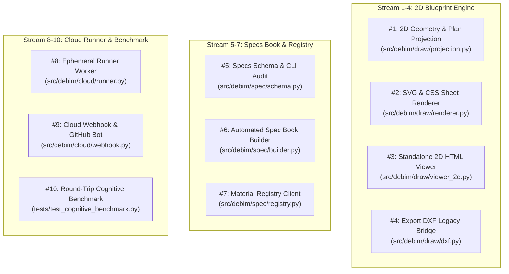

# JULES_MASTER_PLAN.md — 10-Stream Parallel Work Breakdown & GitHub Issue Blueprints

> **"10 Independent Workstreams for Jules & Autonomous Agents: Zero Merge Conflicts, Maximum Velocity."**  
> เอกสารแผนงานการแบ่งงานออกเป็น 10 สายงานอิสระที่สามารถเปิด GitHub Issues พร้อมติด label `jules` เพื่อให้ AI Agents ทำงานคู่ขนานกันได้ทันที โดยไม่มีการแก้ไฟล์ชนกัน (Conflict-Free Design)

---

## 🧭 1. Architectural Independence Matrix (ตารางป้องกันการทำงานชนกัน)

เพื่อให้รันพร้อมกัน 10 งานได้โดยไม่เกิด Git merge conflict แต่ละงานจะถูกกำหนดขอบเขตโฟลเดอร์และไฟล์อย่างเคร่งครัด:

---

## 📋 2. Detailed 10 GitHub Issue Blueprints (พร้อมก๊อปปี้ไปเปิด Issue `jules`)

---

### 🟢 Issue #1: `[jules] Core 2D Cut-Plane & Geometry Projection Engine`
- **Labels:** `jules`, `feature`, `2d-engine`
- **Files to create/modify:** `src/debim/draw/projection.py`, `tests/test_draw_projection.py`
- **Objective:** สร้างฟังก์ชันตัด Section อาคารในระนาบแนวนอน (Cut Plane ที่ความสูง $Z$ เช่น 1.20m จากระดับพื้น) และการฉายเส้นบนลงล่าง (Top Projection)
- **Key Deliverables:**
  - ใช้ `shapely` หรือ 2D Boolean ในการคำนวณรอยตัดของ `walls`, `columns`, `doors`, `windows`
  - คืนค่าโครงสร้างข้อมูล 2D Primitives: Cut Polygons (หนัก), Projection Polygons (เบา), Centerlines (เส้น Grid)
  - Unit test ครอบคลุมการตัดอาคารทดสอบ Farnsworth House และบ้าน 2 ชั้น

---

### 🟢 Issue #2: `[jules] 2D SVG & CSS Sheet Builder with Thai Font & Dimensions`
- **Labels:** `jules`, `feature`, `2d-engine`
- **Files to create/modify:** `src/debim/draw/renderer.py`, `src/debim/draw/templates/`, `tests/test_draw_renderer.py`
- **Objective:** แปลงข้อมูล 2D Primitives จาก Issue #1 ร่วมกับไฟล์ `sheets/*.yaml` ออกมาเป็น SVG และ PDF A3/A4
- **Key Deliverables:**
  - รองรับ CSS Paged Media `@page { size: A3 landscape; }` และฟอนต์ Google Fonts `Sarabun`
  - ระบบลากเส้น Dimension บอกระยะเสา Grid และกรอบอาคารอัตโนมัติ พร้อม Masking ไม่ให้เส้นทับตัวหนังสือ
  - กรอบแบบ Title Block พร้อมดึงข้อมูลจาก `_project_info.yaml` และตารางสารบัญแบบ (Sheet Index) อัตโนมัติ

---

### 🟢 Issue #3: `[jules] Standalone Interactive 2D HTML Viewer (viewer_2d.html)`
- **Labels:** `jules`, `feature`, `viewer`
- **Files to create/modify:** `src/debim/draw/viewer_2d.py`, `src/debim/draw/templates/viewer_2d.html`, `tests/test_viewer_2d.py`
- **Objective:** สร้างตัวแสดงผล 2D HTML แบบ Standalone เปิดดูบนเบราว์เซอร์ น้ำหนักเบา ไร้ 3D WebGL
- **Key Deliverables:**
  - แถบ Sheet Drawer ด้านข้าง สลับแผ่นแบบ (A-000, A-101, A-102, S-101)
  - รองรับ Pan & Pinch-to-Zoom แบบเวกเตอร์ไม่แตก (SVG viewport navigation)
  - Interactive Digital Measurement Ruler (คลิก 2 จุดบนจอเพื่อวัดระยะทางจริง)
  - ปุ่ม Native Print สั่งแปลงเป็น PDF สเกลจริงผ่านหน้าต่างพิมพ์ของเบราว์เซอร์

---

### 🟢 Issue #4: `[jules] Export-Only 2D DXF Generator via ezdxf`
- **Labels:** `jules`, `feature`, `legacy-bridge`
- **Files to create/modify:** `src/debim/draw/dxf.py`, `tests/test_draw_dxf.py`
- **Objective:** ส่งออกแปลน 2D เป็นไฟล์ AutoCAD DXF ทางเดียวสำหรับทีมดราฟต์แมน
- **Key Deliverables:**
  - ใช้ไลบรารี `ezdxf` แยก Layer ชัดเจน: `A-WALL`, `S-COLS`, `A-DOOR`, `A-WIND`, `A-GRID`, `A-DIMS`
  - เสาถูก Hatch ลวดลายทึบ, เส้น Grid เป็นประเภท Centerline Dash-dot
  - มีสไตล์ฟอนต์ภาษาไทยมาตรฐานสำหรับ CAD (เช่น Cordia/Angsana)

---

### 🟢 Issue #5: `[jules] Declarative Specifications Schema & Discrepancy Auditor`
- **Labels:** `jules`, `feature`, `specs-engine`
- **Files to create/modify:** `src/debim/spec/schema.py`, `src/debim/spec/audit.py`, `tests/test_spec_audit.py`
- **Objective:** สร้าง Pydantic Schema สำหรับสเปกวัสดุ และระบบ Audit ตรวจสอบความสอดคล้อง
- **Key Deliverables:**
  - Schema รองรับ: MasterFormat, มอก./ASTM, คุณสมบัติ, วิธีเตรียมพื้นผิว, วิธีติดตั้ง, การรับประกัน
  - ฟังก์ชัน `audit_project_specs(model, specs)` ตรวจสอบว่ามีวัสดุตัวไหนใน `project.yaml` ที่ขาดสเปก หรือมีสเปกตัวไหนที่ไม่ได้ถูกใช้งานในตึกจริง

---

### 🟢 Issue #6: `[jules] Automated Specification Book Compiler (PDF/Markdown)`
- **Labels:** `jules`, `feature`, `specs-engine`
- **Files to create/modify:** `src/debim/spec/builder.py`, `tests/test_spec_builder.py`
- **Objective:** คอมไพล์รวบรวมสเปกวัสดุทั้งหมดที่ใช้งานจริงในอาคาร ออกมาเป็นเล่มรายการประกอบแบบ
- **Key Deliverables:**
  - จัดเรียงหมวดหมู่ตามมาตรฐาน MasterFormat (หมวด 03 คอนกรีต, หมวด 04 ก่ออิฐ, หมวด 09 สี/ผิวสัมผัส)
  - สร้างหน้าปก, สารบัญเล่ม, และเลขหน้าอัตโนมัติ
  - รองรับการ Export เป็น Markdown เล่มรวม และ PDF พร้อมจัดสไตล์แบบทางการ

---

### 🟢 Issue #7: `[jules] Open Material Registry Client & Package Manager`
- **Labels:** `jules`, `feature`, `specs-engine`
- **Files to create/modify:** `src/debim/spec/registry.py`, `tests/test_spec_registry.py`
- **Objective:** ระบบ Package Manager สำหรับดาวน์โหลดและค้นหาสเปกวัสดุ (`debim spec add @pkg`)
- **Key Deliverables:**
  - ค้นหาและดึงไฟล์สเปก Markdown จาก Git repository หรือ Registry URL กลาง
  - รองรับ Local Cache (`~/.debim/registry_cache/`) ป้องกันการดาวน์โหลดซ้ำ
  - ตรวจสอบความถูกต้องของสเปกก่อนติดตั้งเข้าโปรเจกต์

---

### 🟢 Issue #8: `[jules] Cloud Ephemeral Runner Container & Temp Storage Lifecycle`
- **Labels:** `jules`, `feature`, `platform`
- **Files to create/modify:** `src/debim/cloud/runner.py`, `tools/cloud/Dockerfile`, `tests/test_cloud_runner.py`
- **Objective:** เอนจินรันเนอร์บน Docker / Google Cloud Run สำหรับรับไฟล์ YAML มาคอมไพล์บน RAM/Temp Disk
- **Key Deliverables:**
  - รับ Payload (YAML files หรือ Git repo URL) เข้ามาประมวลผลใน Scratch Directory
  - ส่งออกผลลัพธ์: 3D HTML, 2D HTML, IFC4, และ BOQ Summary
  - ฟังก์ชัน Auto-Purge ลบไฟล์ชั่วคราวทิ้งทันทีเมื่อคอมไพล์เสร็จ หรือตามเวลา TTL ที่กำหนด (Zero Storage Footprint)

---

### 🟢 Issue #9: `[jules] Git Webhook Listener & debim[bot] Auto-Committer`
- **Labels:** `jules`, `feature`, `platform`
- **Files to create/modify:** `src/debim/cloud/webhook.py`, `src/debim/cloud/git_sync.py`, `tests/test_git_sync.py`
- **Objective:** ระบบเชื่อมต่อ GitHub App รับ Webhook เมื่อมี `git push` และคอมมิตผลลัพธ์กลับ
- **Key Deliverables:**
  - ตรวจจับการเปลี่ยนแปลงใน `project.yaml` หรือ `sheets/*.yaml` ผ่าน GitHub Webhook
  - สั่ง Trigger Runner อัตโนมัติ
  - ระบบสร้าง Git Commit ในนามบอท `debim[bot]` ส่งกลับเข้า Branch เมื่อ AI ช่วยแก้ไขแบบ

---

### 🟢 Issue #10: `[jules] Round-Trip Cognitive Regression Benchmark Engine`
- **Labels:** `jules`, `feature`, `testing-benchmark`
- **Files to create/modify:** `tests/test_cognitive_benchmark.py`, `src/debim/benchmark/cognitive.py`
- **Objective:** เครื่องมือทดสอบความสมบูรณ์ของแบบ 2D และวัดความฉลาดของ AI Vision Models
- **Key Deliverables:**
  - แปลง `project.yaml` สู่ภาพแปลน 2D PNG
  - จำลอง/ส่งภาพให้ AI Vision Model สกัดข้อมูลกลับเป็น `reconstructed.yaml`
  - คำนวณ **Entity Retention Rate** (เสา/ผนัง/ประตู หายหรือไม่) และ **Coordinate MAE**
  - แสดงผลคะแนน Leaderboard สรุปประสิทธิภาพของแบบก่อสร้างและโมเดล AI
