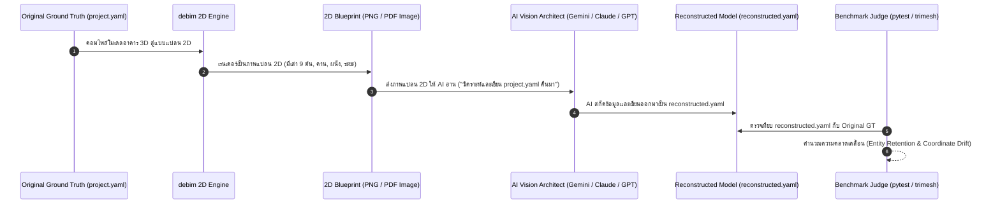

# ROADMAP_2D_DRAWINGS.md — Declarative 2D Architectural Drafting & Visual Regression Benchmark

> **"A building drawing is code, compiled for both human craft and machine cognition."**  
> เอกสารข้อกำหนดสถาปัตยกรรมระบบการสร้างแบบก่อสร้าง 2D (Building-as-Code to 2D Blueprints), โครงสร้างชีตข้อมูล Declarative YAML, เวกเตอร์สเกลจริงไร้ปัญหาสระภาษาไทย, การส่งออก DXF ทางเดียว, และ **Round-Trip Cognitive Regression Benchmark** สำหรับทดสอบความสามารถของ AI Vision Models

---

## 🏛️ 1. Core Philosophy & Architectural Intent (ปรัชญาและเสาหลัก)

1. **Deterministic Vector Projection (จากคณิตศาสตร์ 3D สู่เวกเตอร์ 2D โดยตรง):**
   - แบบ 2D ไม่ได้วาดลอยๆ แต่เป็นการตัด Section และ Projection ทางเรขาคณิตโดยตรงจาก `project.yaml`
   - หมดปัญหาระยะในแบบไม่ตรงกับโครงสร้างจริง (Zero Dimension Discrepancy)
2. **Web-Native & Zero-Font-Friction (ขจัดปัญหาฟอนต์ไทย 100%):**
   - ทิ้ง Pipeline โบราณที่ต้องพึ่งพา DXF font/SHX
   - ใช้สถาปัตยกรรม **SVG + CSS Paged Media + Google Web Fonts (Sarabun/Prompt) + Headless Chromium** พิมพ์ลง PDF คมชัดระดับเวกเตอร์ สระภาษาไทยวรรณยุกต์ไม่ลอย/ไม่เพี้ยน 100%
3. **Two-Layer Decoupled Architecture (โมเดลอาคารแยกจากแผ่นแบบ):**
   - ตัวตึก 3D อยู่ใน `project.yaml` (Single Source of Truth)
   - การจัดหน้ากระดาษ กฎการแสดง/ซ่อน และคำอธิบายประกอบ แยกอยู่ในโฟลเดอร์ `sheets/*.yaml` (1 แผ่นแบบ = 1 ไฟล์)
4. **Standalone Interactive 2D HTML Blueprint Viewer (ตัวแสดงผล 2D บนเว็บแยกต่างหาก):**
   - มี 2D Web Viewer แยกจาก 3D Viewer อย่างชัดเจน เพื่อเน้นการเปิดอ่านแบบก่อสร้างหน้างานบนมือถือ/แท็บเล็ต/แล็ปท็อปโดยไม่ต้องโหลด 3D Engine หนักๆ
   - ซูม Pan-and-Scan แบบเวกเตอร์ไม่แตก, สลับดูแผ่นแบบ (Sheet Navigation), วัดระยะบนหน้าจอ (Interactive Measurement Ruler), และกดปุ่ม Print to PDF ได้ในคลิกเดียว
5. **Export-Only Legacy Bridge (รองรับดราฟต์แมนบน CAD ทางเดียว):**
   - ส่งออกเส้น 2D เปล่าเป็น `DXF` แยกเลเยอร์มาตรฐาน (`A-WALL`, `S-COLS`, `A-GRID`) สำหรับผู้รับเหมาหรือดราฟต์แมนที่ต้องการทำงานต่อบน AutoCAD
   - **ไม่รับ DXF แปลงกลับเป็น YAML** เพื่อหลีกเลี่ยงขยะเรขาคณิตและรักษาความเสถียรของระบบ
6. **Round-Trip Cognitive Benchmark (การวัดคุณภาพแบบก่อสร้างผ่านสายตา AI):**
   - แบบก่อสร้างที่ดีเลิศ มนุษย์หน้างานต้องอ่านรู้เรื่อง และ **AI Vision Model ต้องถอดรหัสความหมายกลับมาได้ครบถ้วน 100% ไม่มีชิ้นส่วนสูญหาย**

---

## 📂 2. File & Directory Structure (โครงสร้างไฟล์และโฟลเดอร์)

```plaintext
my_project/
├── project.yaml                 # 3D Model Manifest (Single Source of Truth)
├── prices.yaml                  # Cost & BOQ Catalog
└── sheets/                      # โฟลเดอร์รวมแผ่นแบบก่อสร้าง 2D
    ├── _project_info.yaml       # ข้อมูลโครงการส่วนกลาง (ชื่อ, สถาปนิก, วิศวกร, วันที่, Rev)
    ├── A-000_cover_index.yaml   # หน้าปก และสารบัญแบบอัตโนมัติ (Auto Sheet Index)
    ├── A-101_floor_1.yaml       # แปลนพื้นชั้น 1
    ├── A-102_floor_2.yaml       # แปลนพื้นชั้น 2
    ├── A-201_elevations.yaml    # รูปด้าน (Elevations 1-4)
    ├── A-301_sections.yaml      # รูปตัด (Building Sections A-A, B-B)
    ├── S-101_footing_cols.yaml  # แปลนโครงสร้างฐานราก-เสา (หมวดวิศวกรรมโครงสร้าง)
    └── styles/                  # ธีมและสไตล์น้ำหนักเส้น
        └── thai_standard.css    # กฎน้ำหนักเส้นตามมาตรฐานสมาคมสถาปนิกสยาม / วสท.
```

---

## 📄 3. Declarative Sheet Manifest (`sheets/*.yaml` Specification)

โครงสร้างแผ่นละ 1 ไฟล์ที่ออกแบบให้อ่านง่ายสำหรับทั้งมนุษย์และ AI:

```yaml
# ==========================================
# sheets/A-101_floor_1.yaml
# ==========================================
sheet:
  number: "A-101"
  title: "แปลนพื้นชั้น 1"
  category: "Architectural"      # Architectural, Structural, MEP
  revision: "R0"
  paper:
    size: "A3"                   # A4, A3, A2, A1
    orientation: "landscape"
    margin_mm: [15, 10, 10, 10]  # ซ้าย (เผื่อเย็บเล่ม), บน, ขวา, ล่าง
  scale: "1:100"

# --- การควบคุมมุมมอง (View & Visibility Filters) ---
view:
  type: "floor_plan"             # floor_plan, elevation, section, detail
  level: "Floor 1"
  cut_plane_z: 1.20              # ตัดที่ระดับ +1.20 ม. จากพื้นชั้น 1
  visibility:
    show: ["structure", "walls", "doors", "windows", "stairs", "sanitary"]
    hide: ["furniture", "ceiling_grid", "electrical"] # ซ่อนของรกตา เพื่อให้แบบโล่งสะอาด

# --- กฎการลากเส้นบอกระยะอัตโนมัติ (Automated Dimensions) ---
dimensions:
  auto_grid_lines: true          # ดึงระยะศูนย์กลางเสา Grid อัตโนมัติ
  auto_overall_envelope: true    # ดึงเส้นบอกระยะรวมหัว-ท้ายอาคาร
  elements:
    - target: "openings"         # บอกระยะช่องเปิด ประตู-หน้าต่าง
      offset_distance_m: 0.8     # ระยะเยื้องของเส้นดึงออกจากผนัง

# --- สัญลักษณ์และคำอธิบายประกอบแบบ (Annotations & Symbols) ---
annotations:
  # แท็กบอกห้องและระดับพื้น
  room_tags:
    - room_id: "living_room"
      label: "ห้องนั่งเล่น"
      level: "+0.50"
      finish: "กระเบื้องแกรนิตโต้ 60x60 ซม."
      position: [120, 85]        # พิกัดบนหน้ากระดาษ (mm)

  # ชี้บอกรายละเอียดเฉพาะจุด (Leader Notes)
  leader_notes:
    - text: "รางระบายน้ำ ค.ส.ล. พร้อมฝาตะแกรงเหล็กชุบกัลวาไนซ์"
      target_element: "drain_kitchen"
      text_box_mm: [50, 45]      # พิกัดกล่องข้อความบนกระดาษ A3 (mm)

  # สัญลักษณ์มาตรฐาน (Reusable SVG Snippets)
  symbols:
    - name: "north_arrow_standard"
      position_mm: [390, 265]
      scale: 1.0
    - name: "graphic_scale_bar"
      position_mm: [350, 265]
```

---

## 🎨 4. Drafting Lineweights & Styling Rules (CSS / SVG Standard)

ใช้มาตรฐานน้ำหนักเส้นตามหลักวิชาชีพสถาปัตยกรรม (ISO / วสท.) ผ่าน CSS:

| สัญลักษณ์คลาส CSS | วัตถุประสงค์ (Architectural Elements) | น้ำหนักเส้น (Stroke Width) | สี / ลวดลาย |
|---|---|---|---|
| `.cut-heavy` | แนวตัดโครงสร้างหลัก (เสา, คาน, ผนังรับแรง ค.ส.ล.) | **0.50 mm** | สีดำทึบ / Solid Hatch สีดำ |
| `.cut-medium` | แนวตัดผนังก่ออิฐ, วงกบประตู-หน้าต่าง | **0.35 mm** | สีดำ |
| `.projection` | เส้นขอบฉายชิ้นงานต่ำกว่าแนวตัด (ขอบพื้น, บันได, สุขภัณฑ์) | **0.18 mm** | สีเทาเข้ม (`#333333`) |
| `.annotation` | เส้นบอกระยะ (Dimension Lines), เส้นฉาย Leader | **0.13 mm** | สีเทา (`#666666`) |
| `.grid-centerline` | เส้นแกนเสา Grid Line | **0.18 mm** | เส้นประลูกโซ่ (Dash-dot) |
| `.hidden-overhead` | เส้นประแนวชายคา / ช่องเปิดเหนือศีรษะ | **0.15 mm** | เส้นประ (Dashed) |

### การควบคุมสเกลตัวหนังสือ (Annotative Text Sizing)
- **ตัวหนังสือบอกระยะ (Dimension Text):** สูง **2.0 mm** บนกระดาษจริงเสมอ
- **ชื่อห้องและระดับ (Room Labels):** สูง **3.5 mm** บนกระดาษจริงเสมอ
- **หัวข้อแบบ (Sheet Titles):** สูง **5.0 mm** บนกระดาษจริงเสมอ
- ตัวหนังสือภาษาไทยใช้ฟอนต์ Open Source มาตรฐาน: **Sarabun** หรือ **Prompt** ผ่าน Google Fonts (ตัดปัญหาสระลอย/จม 100%)

---

## 📑 5. Automated Sheet Index (สารบัญแบบอัตโนมัติ)

ระบบจะกวาดอ่านทุกไฟล์ใน `sheets/*.yaml` แล้วคอมไพล์ลงแผ่น `A-000_cover_index.yaml` เป็นตารางสารบัญแบบโดยอัตโนมัติ:

```plaintext
┌────────────────────────────────────────────────────────────────────────┐
│                        สารบัญแบบก่อสร้าง (DRAWING LIST)                 │
├────────────┬─────────────────────────────┬──────────┬────────┬─────────┤
│ เลขที่แบบ   │ ชื่อแผ่นแบบ                 │ สเกล     │ แก้ไข   │ หมวด    │
├────────────┼─────────────────────────────┼──────────┼────────┼─────────┤
│ A-000      │ ปกและสารบัญแบบ              │ N/A      │ R0     │ สถาปัตย์│
│ A-101      │ แปลนพื้นชั้น 1              │ 1:100    │ R0     │ สถาปัตย์│
│ A-102      │ แปลนพื้นชั้น 2              │ 1:100    │ R0     │ สถาปัตย์│
│ A-201      │ รูปด้าน 1-4                 │ 1:100    │ R0     │ สถาปัตย์│
│ S-101      │ แปลนฐานรากและเสาโครงสร้าง   │ 1:100    │ R0     │ โครงสร้าง│
└────────────┴─────────────────────────────┴──────────┴────────┴─────────┘
```

---

## 🖥️ 6. Standalone 2D HTML Blueprint Viewer (`viewer_2d.html`)

เพื่อประสบการณ์เปิดดูแบบหน้างานที่ลื่นไหล น้ำหนักเบา และประหยัดแบตเตอรี่ ระบบจะมีตัวแสดงผล **HTML 2D แยกต่างหากจาก 3D Viewer**:

```plaintext
my_project/
└── dist/
    ├── viewer.html         # 3D Three.js Model Viewer (สำหรับหมุนดู 3D ก้อนอาคาร)
    └── viewer_2d.html      # 2D Interactive Blueprint Book (สำหรับกางอ่านแบบ 2D ทุกแผ่น)
```

### 🌟 ฟีเจอร์หลักของ `viewer_2d.html`:
1. **Zero-Lag Vector Rendering:** ใช้ SVG บริสุทธิ์ ไม่มีภาระ WebGL 3D โหลดเร็วภายในเสี้ยววินาทีบนมือถือและแท็บเล็ต
2. **Sheet Navigator & Drawer:** แถบข้างสลับแผ่นแบบ (A-000 สารบัญ, A-101 แปลนชั้น 1, A-102 แปลนชั้น 2, S-101 โครงสร้าง) พร้อมค้นหาชื่อแผ่น
3. **Smooth Pan & Pinch-to-Zoom:** ซูมเข้าตรวจดูเสาและตัวเลขระยะได้ลึกถึงระดับมิลลิเมตรโดยที่เส้นและตัวหนังสือไม่แตก
4. **Interactive Measurement Tool (ไม้บรรทัดดิจิทัล):** ช่างสามารถคลิก 2 จุดบนหน้าจอเพื่อวัดระยะทางจริงได้ทันที แม้จุดนั้นจะไม่ได้เขียนตัวเลขบอกระยะไว้
5. **Layer Toggle on the Fly:** สวิตช์เปิด/ปิด เลเยอร์งานสถาปัตย์, งานโครงสร้าง, หรือแนว Grid บนเบราว์เซอร์ได้สดๆ
6. **One-Click Native Print:** ปุ่ม Print ส่งตรงไปยังฟังก์ชัน Print ของเบราว์เซอร์เพื่อแปลงเป็นไฟล์ PDF สเกลจริงหรือสั่งออกเครื่องพิมพ์ A3/A4 ได้ทันที

---

## 🧪 7. The Novel "Round-Trip Cognitive Regression Benchmark" (ไอเดียการทดสอบสุดแหวกแนว)

> **"แบบก่อสร้าง 2D ที่สมบูรณ์แบบ ต้องสื่อสารได้ชัดเจนจน AI Vision อ่านแล้วสร้างตึกกลับมาได้ตรงเป๊ะ 100%"**

การหาชุดข้อมูล IFC หรือ CAD 2D คุณภาพสูงจากภายนอกมาเทียบเคียงเป็นเรื่องยากมาก เราจึงสร้าง **Cognitive Closed-Loop Benchmark (วงจรทดสอบการถดถอยความเข้าใจของ AI)**:



### 🎯 ดัชนีชี้วัด (Cognitive Benchmark Metrics)

1. **Entity Retention Rate (อัตราการอยู่รอดของชิ้นส่วน):**
   $$\text{Retention Rate} = \frac{\text{Count of Recognized Elements}}{\text{Total Ground Truth Elements}} \times 100\%$$
   - *ตัวอย่างความล้มเหลวของแบบ 2D:* แปลนมีเสา 9 ต้น แต่แบบเขียนตัวหนังสือหรือเส้นบอกระยะทับเสาต้นมุม จน AI อ่านแปลนแล้วเห็นเสาแค่ 7 ต้น $\rightarrow$ **Retention = 77.8% (Fail!)**
2. **Coordinate & Dimensional Accuracy (ความคลาดเคลื่อนของพิกัดและระยะ):**
   - คำนวณ Mean Absolute Error (MAE) ของระยะเสาและขนาดห้อง ระหว่างของเดิมกับที่ AI อ่านได้
3. **Clutter Penalty (บทลงโทษความรกของแบบ):**
   - วัดว่าโมเดล AI เกิด Hallucination (เห็นชิ้นส่วนผีที่ไม่มีจริง เช่น อ่านเส้นบอกระยะเป็นผนัง) กี่จุด

### 🏆 ประโยชน์สองต่อ (Dual Purpose):
- **วัดคุณภาพของ debim 2D Engine:** หากโมเดล AI หลายค่าย (Gemini 1.5/2.0, Claude 3.5 Sonnet, GPT-4o) อ่านแปลนชุดเดียวกันแล้วเกิดอาการ "เสาหาย" พร้อมๆ กัน แสดงว่า **ระบบจัดวางแปลนของ debim ยังแสดงผลไม่ชัดเจนพอ** (ต้องปรับปรุง Contrast, Lineweight, หรือตำแหน่ง Leader)
- **AI Architect Leaderboard:** วัดได้ชัดเจนว่า **โมเดล AI ค่ายใดคือ "สุดยอดผู้ช่วยสถาปนิกและวิศวกร"** ที่อ่านแบบก่อสร้าง 2D ซับซ้อนได้แม่นยำที่สุดในโลก!

---

## 🛠️ 8. CLI Command Surface

```bash
# คอมไพล์แบบก่อสร้าง 2D ทุกแผ่นออกเป็น PDF เล่มรวม
debim draw build -m project.yaml --sheets sheets/ -o dist/blueprints.pdf

# เปิดดูแบบก่อสร้าง 2D บนเบราว์เซอร์ (Interactive 2D Blueprint Book)
debim draw view -m project.yaml --sheets sheets/ -o dist/viewer_2d.html

# ส่งออกเป็นไฟล์ DXF สำหรับทีมดราฟต์แมน AutoCAD (Export-only)
debim draw export-dxf -m project.yaml --sheet sheets/A-101_floor_1.yaml -o dist/A-101.dxf

# รันการทดสอบคุณภาพแบบก่อสร้าง (DQS: Drafting Quality Score)
debim draw test -m project.yaml --sheets sheets/

# รัน Cognitive Regression Benchmark ร่วมกับ AI Vision
debim draw benchmark-cognitive --model gemini-2.0-flash --sheet sheets/A-101_floor_1.yaml
```
