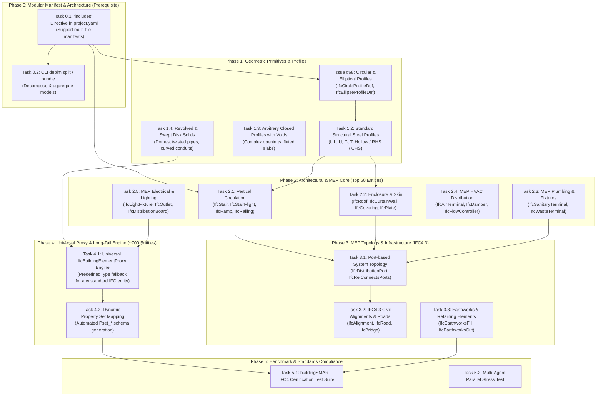

# 🗺️ debim Roadmap: Full buildingSMART IFC Support (~800 Entities)

> **"หัวใจของ debim เริ่มจากการอยากให้ AI ทำ BOQ แต่การให้ AI คำนวณตึกทั้งหลังตรงๆ AI ตายแน่ จึงต้องใช้แบบจำลองคณิตศาสตร์ (BIM) ทว่ามาตรฐาน IFC ดั้งเดิมก็ซับซ้อนเกินไป หนักสมอง AI อีก จึงกลั่นออกมาเป็น Declarative YAML — แต่ผลพลอยได้ที่ได้รับกลับยิ่งใหญ่กว่าเป้าหมายแรกเริ่ม"**

เอกสารนี้ระบุแผนการพัฒนาระยะยาว (Master Roadmap) ในการขยายขีดความสามารถของ **debim** ให้รองรับมาตรฐานสถาปัตยกรรมและวิศวกรรมสากล **IFC4 / IFC4.3 (~800 Entities)** ครบถ้วน โดยใช้การแบ่งซอยงานเป็นชิ้นเล็กๆ (Atomic Issues) ที่มอบหมายให้ AI Coding Agent (**Jules**) ดำเนินการผ่าน GitHub Issues ที่ติดป้ายกำกับ `label: jules` ได้อย่างมีเสถียรภาพและไม่เกิดปัญหา Context Window ล้น

---

## 🏛️ 1. Core Principles & Architecture Strategy

การขยายระบบไปสู่ 800 Entities ต้องรักษาเสาหลัก 5 ประการของ debim:

1. **Building-as-Code & Git-Native:** อาคารต้องอยู่ในรูป Text/YAML ที่กะทัดรัด ทำ Git diff และ Version control ได้จริง
2. **Modular Multi-File Architecture:** ห้ามรวม 800 ชนิดไว้ในไฟล์ยักษ์เดี่ยว (`project.yaml` ก้อนโตจะทำให้ AI เกิดภาพหลอน Hallucination และ Git Merge Conflict ทันที) ต้องใช้สถาปัตยกรรม `includes:` แยกตามโซน ชั้น หรือระบบ
3. **Dual Representation:** 90% รูปทรงเรขาคณิตแบบ Procedural/Extrusion (สำหรับคำนวณโครงสร้างและ QTO/BOQ ที่แม่นยำ) + 10% Baked Asset GLB (สำหรับชิ้นงานดีเทลประณีต)
4. **Deterministic Code Compliance:** ทุกชิ้นส่วนต้องมี Unit Test กำกับ และคำนวณปริมาณงานได้ Deterministic 100%
5. **Atomic Sub-tasks for AI:** มอบหมายให้ Jules ทำงานทีละ 1 Entity หรือ 1 โดเมนย่อย โดยมี Definition of Done (DoD) ที่ชัดเจน

---

## 🌊 2. Dependency Graph & Phase Overview



---

## 📋 3. Phased Breakdown & Actionable Jules Tasks

### 🔴 Phase 0: Modular Manifest Architecture (มาตรการสำคัญที่สุด - ทำก่อนเพื่อน)
> **เป้าหมาย:** ทำให้นางแบบอาคารขนาดใหญ่สามารถแยกย่อยเป็นหลายไฟล์ได้ เช่น แยกตามชั้น (storeys/), ระบบ (structure/, mep/), หรือโซน (zones/) ป้องกัน Context Window ล้น

- [x] **Task 0.1:** `feat(loader): Support multi-file modular manifest via 'includes' pattern in project.yaml` *(เสร็จสิ้น: Issue #70, PR #71)*
  - **Scope:** `src/debim/schema.py`, `src/debim/resolver.py`, `src/debim/cli.py`
  - **Description:** เพิ่มคีย์ `includes: ["models/**/*.yaml"]` ให้กับ `project.yaml` โดย resolver จะทำการ merge entity lists (columns, beams, walls, pipes ฯลฯ) เข้าด้วยกันอย่างราบรื่นก่อนรัน spatial resolution
  - **Benefits:** AI (รวมถึง Jules) สามารถเปิดอ่านและแก้ไขไฟล์ย่อย (เช่น `models/first_floor/columns.yaml`) ที่มีขนาดเพียง 10-20 บรรทัดได้ โดยไม่ต้องโหลดทั้งตึก
- [x] **Task 0.2:** `feat(cli): Add 'debim split' and 'debim bundle' commands` *(เสร็จสิ้น)*
  - **Scope:** `src/debim/cli.py`, `src/debim/modular.py`
  - **Description:** คำสั่งแยกไฟล์ `project.yaml` ก้อนใหญ่ ออกเป็นโครงสร้างไดเรกทอรีมาตรฐานตาม storey/system และคำสั่งรวมกลับเป็น single-file artifact

#### ตัวอย่างโครงสร้าง Modular Directory ที่รองรับ:
```plaintext
my_project/
├── project.yaml              # Core metadata, site, grids, storeys, includes: ["models/**/*.yaml"]
├── prices.yaml               # Cost catalog (with includes: ["prices/modules/*.yaml"])
└── models/
    ├── structure/
    │   ├── foundations.yaml  # IfcFooting
    │   ├── columns.yaml      # IfcColumn
    │   └── beams.yaml        # IfcBeam
    ├── architecture/
    │   ├── walls.yaml        # IfcWall
    │   ├── doors_windows.yaml# IfcDoor, IfcWindow
    │   └── roofs.yaml        # IfcRoof
    └── mep/
        ├── plumbing.yaml     # IfcPipeSegment, IfcSanitaryTerminal
        └── electrical.yaml   # IfcLightFixture, IfcDistributionBoard
```

---

### 🟡 Phase 1: Geometric Primitives & 2D Profiles
> **เป้าหมาย:** สร้าง "ไวยากรณ์เรขาคณิต" ให้ครอบคลุมรูปทรงหน้าตัดทุกแบบในมาตรฐาน buildingSMART เพื่อให้ทุก Entity ในระยะถัดไปนำไปประกอบร่างได้

- [x] **Task 1.1:** `feat: Support Circular and Elliptical profiles (IfcCircleProfileDef, IfcEllipseProfileDef)` *(เสร็จสิ้น: Issue #68, PR #69)*
  - **DoD:** รองรับหน้าตัดวงกลมและวงรี, คำนวณ QTO (Area/Volume), เรนเดอร์กระบอกสูบ/ท่อโค้งใน Three.js, ส่งออก IFC4
- [x] **Task 1.2:** `feat: Support Standard Structural Steel Profiles (I, H, L, C, T, RHS, CHS)` *(เสร็จสิ้น)*
  - **Scope:** `IfcIShapeProfileDef`, `IfcLShapeProfileDef`, `IfcUShapeProfileDef`, `IfcTShapeProfileDef`, `IfcRectangleHollowProfileDef`
  - **DoD:** สเปกเหล็กรูปพรรณ มอก./AISC, คำนวณน้ำหนักเหล็กตามตาราง QTO, เรนเดอร์ Three.js ExtrudeGeometry
- [x] **Task 1.3:** `feat: Support Arbitrary Closed Profile with Voids` *(เสร็จสิ้น)*
  - **Scope:** `IfcArbitraryClosedProfileDefWithVoids`
  - **DoD:** เจาะรูหน้าตัดเสา/คาน/พื้นหลายเหลี่ยม, คำนวณพื้นที่สุทธิหักรูกลวง
- [x] **Task 1.4:** `feat: Support Swept Disk & Revolved Area Solids` *(เสร็จสิ้น: Issue #72, PR #77)*
  - **Scope:** `IfcSweptDiskSolid`, `IfcRevolvedAreaSolid`
  - **DoD:** รองรับท่อโค้งอิสระตาม 3D Spline, โครงสร้างโดม และหลังคาโค้งหมุนวน

---

### 🟢 Phase 2: Architectural & MEP Core Entities (Top 50 Entities)
> **เป้าหมาย:** เพิ่ม Entity พื้นฐานที่พบในอาคารจริงมากกว่า 90% ของงานก่อสร้าง โดยแบ่งงานให้ Jules เป็นชุดๆ ชุดละ 1 โดเมน

- [x] **Task 2.1 (Circulation):** `feat: Support IfcStair, IfcStairFlight, IfcRamp, and IfcRailing` *(เสร็จสิ้น: Issue #73, PR #76)*
  - บันไดตรง, บันไดวน, ชานพัก, ทางลาดผู้พิการ, และราวกันตก
  - QTO: ปริมาตรคอนกรีตบันได, พื้นผิวไม้/กระเบื้องลูกตั้ง-ลูกนอน, ความยาวราวกันตก
- [x] **Task 2.2 (Enclosure):** `feat: Support IfcRoof, IfcCurtainWall, and IfcPlate` *(เสร็จสิ้น: Issue #80, PR #82)*
  - หลังคาจั่ว, หลังคาปั้นหยา, ผนังกระจกเคอร์เทนวอลล์, และแผ่นปิดผิว
  - QTO: พื้นที่หลังคาลาดเอียง, จำนวนแผ่นกระจก, โครงคร่าวอลูมิเนียม
- [x] **Task 2.3 (Plumbing & Sanitation):** `feat: Support IfcSanitaryTerminal and IfcWasteTerminal` *(เสร็จสิ้น: Issue #74, PR #78)*
  - สุขภัณฑ์, อ่างล้างหน้า, โถปัสสาวะ, Floor Drain, ถังดักไขมัน
  - QTO: นับจำนวนชิ้น, จับคู่กับราคาอุปกรณ์สุขภัณฑ์ใน `prices.yaml`
- [x] **Task 2.4 (HVAC Distribution):** `feat: Support IfcAirTerminal, IfcDamper, and IfcFlowController` *(เสร็จสิ้น: Issue #81, PR #83)*
  - หัวจ่ายลม (Diffuser), แดมเปอร์กันควัน/ลม, พัดลมระบายอากาศ
  - QTO: นับจำนวน, พื้นที่หน้าตัดท่อลม
- [x] **Task 2.5 (Electrical Distribution):** `feat: Support IfcLightFixture, IfcOutlet, and IfcElectricDistributionBoard` *(เสร็จสิ้น: Issue #75, PR #79)*
  - โคมไฟ LED, เต้ารับไฟฟ้า, ตู้โหลดเซ็นเตอร์ (MDB/DB)
  - QTO: นับจำนวน, ความยาวรางสายไฟและท่อร้อยสาย

---

### 🔵 Phase 3: MEP Topology & Infrastructure (IFC4.3)
> **เป้าหมาย:** รองรับงานระบบที่เชื่อมโยงกันเป็นร่างแห (Graph Network) และงานโครงสร้างพื้นฐานโยธา (Civil/Infrastructure)

- [x] **Task 3.1:** `feat: Port-based System Topology (IfcDistributionPort & Connection Graphs)` *(เสร็จสิ้น: Issue #87, PR #90)*
  - เชื่อมโยงท่อและสายไฟจากต้นทางสู่ปลายทาง (Flow Direction, Pressure Drop calculation)
- [ ] **Task 3.2:** `feat(civil): Support IFC4.3 Alignment & Road Entities (IfcAlignment, IfcRoad, IfcBridge)`
  - แนวเส้นทางตามแนวราบ-แนวดิ่ง (Horizontal & Vertical Alignment)
  - องค์ประกอบสะพานและถนน
- [x] **Task 3.3:** `feat(civil): Support Earthworks & Retaining Structures (IfcEarthworksFill, IfcRetainingWall)` *(เสร็จสิ้น: Issue #84, PR #86)*
  - งานขุดดิน-ถมดิน, กำแพงกันดิน, ปริมาตรดินตัดดินถม (Cut & Fill Volume QTO)

---

### 🟣 Phase 4: Universal Proxy & Long-Tail Engine (~700 Entities)
> **เป้าหมาย:** รองรับ Entity นอกสายหลักอีกกว่า 700 ชนิดใน buildingSMART โดยไม่ต้องเขียนโค้ดมือทีละตัว

- [x] **Task 4.1:** `feat: Universal Declarative Proxy Engine for Any IFC Entity` *(เสร็จสิ้น: Issue #85, PR #88)*
  - **แนวคิด:** แทนที่จะเขียนคลาสแยกสำหรับ `IfcBurner`, `IfcChiller`, `IfcInterceptor`, ฯลฯ ใช้โมเดลสากล:
    ```yaml
    proxies:
      - tag: CHILLER-01
        class: IfcEnergyConversionDevice # หรือ IfcChiller
        predefined_type: WATERCOOLED
        geometry:
          box: [3.2, 1.8, 2.0]
        placement:
          storey: ROOF
          grid: [B, 3]
        properties:
          Pset_ChillerTypeCommon:
            NominalCapacity: 500kW
            RefrigerantClass: R134a
    ```
  - **ผลลัพธ์:** ปลดล็อกการส่งออก IFC4 แท้จริงได้ทันทีสำหรับทุก Entity ในสเปก buildingSMART
- [ ] **Task 4.2:** `feat: Automated Pset_* Validation via buildingSMART bSDD (Building Data Dictionary)`
  - ตรวจสอบ Property Set ว่าตรงตามมาตรฐานสากลหรือไม่ผ่าน JSON Schema อัตโนมัติ

---

### ⚪ Phase 5: Verification & Benchmark Certification
- [ ] **Task 5.1:** `test: Implement buildingSMART IFC4 Reference Test Suite in Pytest`
- [ ] **Task 5.2:** `benchmark: Measure Token Efficiency and Compilation Speed for 10,000+ Multi-File Elements`

---

## 🎯 4. Definition of Done (DoD) สำหรับแต่ละ Issue ของ Jules

เพื่อให้การทำงานของ Jules แม่นยำ ไม่หลุดกรอบ และ merge ได้ทันที ทุก Issue ที่เปิดภายใต้ Roadmap นี้ต้องกำหนดให้ Jules ปฏิบัติตามมาตรฐาน 5 ข้อเสมอ:

1. **Schema (`schema.py`):** เพิ่ม Pydantic v2 model พร้อม Type annotation และ default values ครบถ้วน
2. **Resolver (`resolver.py`):** คำนวณพิกัด 3D World Vector จาก Grid/Storey หรืออิสระ 3D
3. **QTO (`qto.py`):** มีสูตรคำนวณปริมาณงาน (Volume $m^3$, Area $m^2$, Length $m$, หรือ Count ชิ้น)
4. **Viewer (`viewer.py`):** มี Three.js procedural geometry หรือ visual fallback ใน 3D HTML Viewer
5. **Unit Tests (`tests/`):** มี Pytest ครอบคลุมการทำงานอย่างน้อย 2-3 Test Cases และการทดสอบเดิมทั้งหมด 150+ ข้อต้อง Pass 100%

---

## 📅 ตารางสรุปการดำเนินงาน (Execution Roadmap)

| Phase | หัวข้องาน | วิธีการส่งมอบ | ผลลัพธ์ที่ได้ |
|---|---|---|---|
| **Phase 0** | Modular Manifest (`includes:`) | เปิด Issue `jules` 2 งาน | ปลดล็อกการสร้างตึกซับซ้อนโดยไม่กิน Token AI |
| **Phase 1** | Profiles & Geometric Primitives | เปิด Issue `jules` 4 งาน (รวม #68) | วาดเสา/คาน/ท่อ โค้ง กลม รี เหล็กรูปพรรณ ได้ครบ |
| **Phase 2** | Architectural & MEP Core (50 Entities) | เปิด Issue `jules` 5 งาน | รองรับ บันได, หลังคา, สุขภัณฑ์, โคมไฟ, แอร์ดักท์ |
| **Phase 3** | MEP Graph & Civil (IFC4.3) | เปิด Issue `jules` 3 งาน | รองรับ ทางเชื่อมท่อ, ถนน, สะพาน, กำแพงกันดิน |
| **Phase 4** | Universal Proxy Engine (~700 Entities) | เปิด Issue `jules` 2 งาน | ครอบคลุมมาตรฐาน IFC4/IFC4.3 ครบทุกชนิด 100% |
| **Phase 5** | Tests & Validation Benchmark | รัน Benchmark Automation | ได้รับการรับรองมาตรฐานสากล Zero-Regression |

---
*บันทึกไว้ในระบบ debim เพื่อเป็นแผนที่นำทางสำหรับการทำงานร่วมกันระหว่าง Human Architect และ AI Agent (Jules)*
