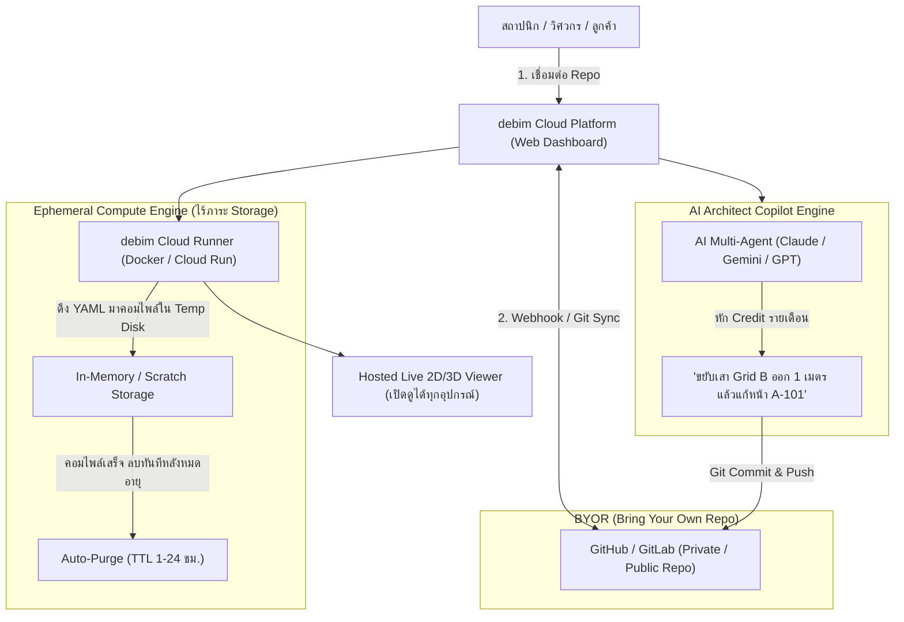

# ROADMAP_PLATFORM.md — debim Cloud: Open-Core SaaS & AI Architect Platform

> **"Code is Free. Intelligence & Seamless Collaboration are the Service."**  
> เอกสารวิสัยทัศน์และการออกแบบสถาปัตยกรรมธุรกิจและระบบคลาวด์สำหรับ **debim Cloud Platform** โมเดล Open-Core Hybrid (คล้าย GitHub / Vercel / Docker Hub ผสม Cursor สำหรับวงการก่อสร้าง)

---

## 💡 1. Executive Summary & Business Philosophy (แก่นแนวคิดธุรกิจ)

โมเดลธุรกิจของซอฟต์แวร์ BIM ดั้งเดิม (เช่น Autodesk Revit, ArchiCAD) คิดค่าไลเซนส์แพงลิบลิ่ว ($3,000+/ปี/คน) และกักขังข้อมูลไว้ในไฟล์ Binary (.rvt, .pln) ที่แชร์ให้คนอื่นดูยากมาก

**debim Cloud ปฏิวัติวงการด้วยแนวคิด "Open-Core + Git-Native + Zero-Storage Overhead":**
1. **Open Source Core (100% Free):** ตัวคอมไพเลอร์ CLI (`debim`), สเปก `project.yaml`, ตัวแปลง IFC, และตัวสร้าง 2D/3D Viewer เป็นโอเพนซอร์ส ใครจะรันบนเครื่องตัวเอง ใช้ฟรีตลอดกาล
2. **BYOR (Bring Your Own Repository - ลูกค้าเก็บไฟล์เองบน Git):** แพลตฟอร์มไม่แบกรับภาระ Storage ลูกค้าเชื่อมต่อ GitHub / GitLab / Bitbucket ของตัวเอง แพลตฟอร์มดึงโค้ดมาประมวลผลบน RAM/Ephemeral Disk ชั่วคราว คอมไพล์เสร็จส่งผลลัพธ์กลับ แล้วล้างทิ้งทันที
3. **Public Projects Free Forever (Open Architecture Community):** โครงการใดที่เจ้าของเปิดเป็นสาธารณะ (Public Repo) ให้บริการคอมไพล์ โฮสต์หน้าเว็บ 3D/2D Viewer ฟรีเต็มที่ เพื่อสร้าง Network Effect ให้โลกมีคลังโค้ดอาคารสาธารณะ
4. **Private Projects Monetization (SaaS Subscription + AI Credits):** โปรเจกต์ส่วนตัวหรือเชิงพาณิชย์ สมัครแพ็กเกจรายเดือน ได้สิทธิ์เข้าถึง Private Repositories และได้รับ **AI Architectural Credits** เพื่อสั่งให้ AI ช่วยแก้แบบ, ถอด BOQ, จัดหน้า 2D Sheet, และตรวจแบบกฎหมายอาคาร

---

## 🏗️ 2. Platform Architecture: How It Works (โฟลว์การทำงาน)

---

## 💰 3. Tier & Pricing Model (รูปแบบแพ็กเกจรายเดือน)

| ฟีเจอร์ / แพ็กเกจ | 🌐 Community (Free) | 💼 Professional ($29 / เดือน) | 🏢 Studio / Enterprise ($99+ / เดือน) |
|---|---|---|---|
| **ประเภท Repositories** | เฉพาะ Public Repositories | Private Repositories (สูงสุด 10 โครงการ) | ไม่จำกัด Private Repositories |
| **พื้นที่จัดเก็บไฟล์ (Storage)** | BYOR (เก็บบน GitHub ลูกค้า) | BYOR (เก็บบน GitHub ลูกค้า) | BYOR (เก็บบน GitHub ลูกค้า / Self-hosted Git) |
| **โฮสติ้งหน้าดูแบบ (2D & 3D)** | **ฟรีตลอดชีพ (สาธารณะ)** | ลิงก์ส่วนตัว + ใส่ Password / SSO | ลิงก์ส่วนตัว + Custom Domain + ฝังในเว็บลูกค้า |
| **แคชไฟล์คอมไพล์ (Ephemeral)** | เก็บ 1 ชั่วโมง แล้วลบ | เก็บ 24 ชั่วโมง แล้วลบ | เก็บ 7 วัน แล้วลบ (หรือดาวน์โหลดเก็บเอง) |
| **AI Architect Credits** | 50 เครดิต / เดือน (ทดลองใช้) | **2,000 เครดิต / เดือน** (~150 คำสั่งสถาปัตย์) | **10,000+ เครดิต / เดือน** + เติมเครดิตเพิ่มได้ |
| **การส่งออกเอกสาร** | IFC4, 3D HTML | IFC4, 3D HTML, **PDF A3 Blueprint, DXF** | ครบทุกฟอร์แมต + Batch Export ทั้งเล่ม |
| **ระบบตรวจแบบกฎหมาย (Compliance)** | กฎหมายอาคารพื้นฐาน | ตรวจระยะร่น, พื้นที่เปิดโล่ง, ที่จอดรถ อัตโนมัติ | ปรับแต่งข้อกำหนดท้องถิ่น (Custom Local By-laws) |

---

## 🤖 4. AI Architectural Copilot: "Credit-Based Magic"

ทำไมลูกค้าถึงยอมจ่ายค่าแพ็กเกจรายเดือน? เพราะ **AI Credits** ช่วยประหยัดเวลาการทำงานของสถาปนิกและผู้รับเหมาจาก "หลายวัน" เหลือ "ไม่กี่วินาที":

1. **Natural Language Drafting (สั่งแก้แบบด้วยภาษาพูด):**
   - *"ช่วยเพิ่มห้องน้ำขนาด 2x2.5m ที่มุมทิศตะวันออกเฉียงเหนือของชั้น 2"*
   - AI หักเครดิต ➔ คำนวณพิกัด ➔ แก้ไข `project.yaml` ➔ คอมไพล์ ➔ โชว์ภาพ 3D/2D ให้ตรวจ ➔ กดบันทึกเป็น Git commit ส่งเข้า GitHub ของลูกค้าทันที
2. **Auto-Sheet Composition (จัดหน้าแบบ 2D อัตโนมัติ):**
   - *"จัดแบบก่อสร้างแผ่น A-101 ให้หน่อย ซ่อนของรกตา ใส่เส้นบอกระยะเฉพาะแนวเสา และใส่ชื่อห้องภาษาไทย"*
   - AI สร้างไฟล์ `sheets/A-101.yaml` ให้เสร็จสรรพ
3. **Instant Value Engineering & Cost Tuning (คุมงบประมาณ):**
   - *"งบเกินไป 500,000 บาท ช่วยเปลี่ยนสเปกพื้นชั้น 2 เป็นไม้ลามิเนต และลดความสูงฝ้าลง 10 ซม. แล้วสรุป BOQ ใหม่มาดู"*
   - AI วิเคราะห์ราคาจาก `prices.yaml` และปรับโมเดลให้อัตโนมัติ

---

## 🛡️ 5. Ephemeral Architecture: Why Zero-Storage is a Superpower

การไม่เก็บไฟล์ถาวร (Ephemeral & Zero-Storage) เป็นแต้มต่อทางธุรกิจมหาศาล:

1. **Cloud Cost ต่ำมาก (High Profit Margin):** แพลตฟอร์มไม่ต้องเสียค่าเช่า Cloud Storage (AWS S3 / Google Cloud Storage) มหาศาลสำหรับไฟล์ 3D ขนาดใหญ่ ต้นทุนหลักมีแค่ค่าประมวลผล CPU ชั่วคราว และค่า API ของโมเดล AI
2. **Enterprise Privacy & Security (ลูกค้าองค์กรสบายใจ):** 
   - ข้อมูลแบบก่อสร้างและราคาของลูกค้าไม่ตกค้างอยู่บนฐานข้อมูลของแพลตฟอร์ม
   - เมื่อคอมไพล์เสร็จ ไฟล์บน Temp Disk จะถูกล้างทิ้ง (TTL Purge) ลูกค้าเป็นเจ้าของทรัพย์สินทางปัญญา (IP) 100% บน Git ของตัวเอง
3. **ไม่มีปัญหา Vendor Lock-in:** หากลูกค้าอยากยกเลิกบริการ เขาก็ยังมีโค้ดอาคารทั้งหมดบน GitHub และสามารถรันคำสั่ง `debim` แบบโอเพนซอร์สบนเครื่องตัวเองได้ตลอดเวลา

---

## 🗺️ 6. Product Development Roadmap (แผนการพัฒนาแพลตฟอร์ม)

### Phase 1: MVP & Git Connector (เดือนที่ 1 - 2)
- [ ] พัฒนาระบบ Authentication (GitHub / Google OAuth)
- [ ] GitHub App Integration: เชื่อมต่อ Git Repository และตั้งค่า Webhook (ตรวจจับ `git push` เพื่อรัน Auto-Compile)
- [ ] Ephemeral Runner Worker: คอนเทนเนอร์รับไฟล์ YAML มารัน `debim compile` และ `debim draw` สู่ RAM/Temp Disk
- [ ] Web Portal: Dashboard แสดงรายการโปรเจกต์ และหน้าฝัง 3D / 2D Viewer

### Phase 2: Credit System & AI Copilot Chat (เดือนที่ 3 - 4)
- [ ] ระบบ Stripe Subscription & Credit Wallet (หักเครดิตตามโทเคน / การเรียก Tool)
- [ ] In-Browser AI Chat Interface (ให้ผู้ใช้แชตสั่ง AI แก้โมเดลอาคาร และเห็น Live Preview 3D/2D อัปเดตทันที)
- [ ] Git Auto-Committer: บอท `debim[bot]` คอมมิตโค้ดที่ AI แก้ไขกลับเข้าสู่ GitHub สาขาของลูกค้า

### Phase 3: Public Community & Showcase (เดือนที่ 5 - 6)
- [ ] หน้า **"debim Explore / Hub"**: แสดงโปรเจกต์โอเพนซอร์สสถาปัตยกรรมระดับโลกที่เปิดดูฟรี (เช่น Farnsworth House, Villa Savoye, บ้านจัดสรรประหยัดพลังงาน)
- [ ] One-Click Fork: ให้ผู้ใช้คนอื่นกด Fork โครงการสาธารณะไปเป็นของตัวเอง เพื่อเริ่มออกแบบต่อได้ทันที
- [ ] Interactive Commenting: มาร์กเกอร์จิ้มบนโมเดล 3D และแบบ 2D เพื่อคอมเมนต์สั่งงานช่างหน้างานแบบ Real-time

---

## 🧠 7. The AI Training Flywheel & Data Licensing Strategy (ยุทธศาสตร์สร้างมูลค่าเมื่อค่าย AI ต้องการข้อมูล)

> **"Why AI Labs Crawling Our YAML is Our Biggest Competitive Moat"**

ในยุค AI Boom ค่าย AI ยักษ์ใหญ่ (OpenAI, Google DeepMind, Anthropic, Meta) กำลัง **ขาดแคลนข้อมูลเชิงโครงสร้างสถาปัตยกรรม (High-Quality Spatial & BIM Data)** อย่างรุนแรง ข้อมูลในอินเทอร์เน็ตมีแต่ภาพ 2D หรือข้อความทั่วไป แต่ไม่มีแบบจำลองคณิตศาสตร์ของอาคารที่สะอาด กะทัดรัด และมีตรรกะผูกโยงกับราคา BOQ ครบถ้วนเหมือน `project.yaml` ของ debim

หากค่าย AI ต้องการนำข้อมูล YAML สาธารณะไปใช้ในการ Pre-train หรือ Fine-tune โมเดล เราจะเปลี่ยนความต้องการนี้ให้เป็นประโยชน์ทางธุรกิจ 4 มิติ:

### 1. 💵 Data Licensing & Enterprise API Contracts (โมเดลเดียวกับ Reddit / Stack Overflow)
- **ToS Data Policy:** ในข้อกำหนดการใช้งานระบุชัดเจนว่า:
  - **Private Repositories:** ข้อมูลของลูกค้าองค์กรและโปรเจกต์ส่วนตัวจะได้รับการปกป้อง 100% ห้ามระบบหรือบุคคลภายนอกนำไปเทรนโมเดลเด็ดขาด (Enterprise-Grade Confidentiality)
  - **Public Repositories:** สำหรับโครงการสาธารณะทั่วไป อนุญาตให้มนุษย์ศึกษาและ Fork ใช้งานฟรี แต่หากบริษัท AI ต้องการดึงชุดข้อมูลทั้งหมดผ่าน API ในปริมาณมหาศาล (Bulk Scraping) เพื่อการค้า ต้องทำสัญญา **Commercial Data Licensing Agreement**
- **Verified BIM Dataset API:** จัดทำชุดข้อมูลสถาปัตยกรรมสังเคราะห์และตรวจสอบแล้ว (Synthetically Verified & Unit-Tested BIM Datasets) ขายให้แก่สถาบันวิจัยและค่าย AI เป็นแพ็กเกจรายปี

### 2. ☁️ Compute Grants & Enterprise Sponsorships
- ค่ายคลาวด์และ AI ยินดีสนับสนุน **Compute Grants (GPUs / Cloud Run) มูลค่า $100,000 – $500,000+** เพื่อแลกกับการเข้าถึงชุดข้อมูล หรือการร่วมพัฒนา Benchmark วิจัยด้าน Spatial Intelligence

### 3. 👑 Becoming the "de facto Standard" of Generative Architecture
- หากโมเดล AI ชั้นนำถูกเทรนด้วยโครงสร้างไวยากรณ์ของ debim:
  - เมื่อผู้ใช้งานทั่วโลกสั่ง AI (ChatGPT, Claude, Gemini) ว่า *"ออกแบบบ้านเดี่ยว 2 ชั้นให้หน่อย"*
  - ตัวโมเดลจะ **สร้างโค้ดออกมาในรูปแบบ `project.yaml` ของ debim โดยอัตโนมัติ**
  - ผลลัพธ์: ผู้ใช้ทั่วโลกจะต้องนำโค้ดนั้นมาเปิดดู คอมไพล์ 2D/3D และสั่งพิมพ์แบบบน **debim Cloud Platform** กลายเป็นมาตรฐานโลกโดยปริยาย (เหมือนที่ Dockerfile กลายเป็นมาตรฐานของคอนเทนเนอร์)

### 4. 🔄 The Self-Reinforcing Product Flywheel
- ยิ่งค่าย AI พัฒนาโมเดลให้เก่งการเขียน `project.yaml` มากเท่าใด ➔ **AI Copilot บน debim Cloud ก็จะยิ่งฉลาดและแม่นยำขึ้นโดยอัตโนมัติ** โดยที่เราไม่ต้องลงทุนสร้างโมเดล Foundation Model เองนับหมื่นล้านบาท
- ลูกค้ายิ่งประทับใจ ยิ่งเข้ามาซื้อแพ็กเกจและเติม **AI Credits** บนแพลตฟอร์มของเราอย่างต่อเนื่อง

---

## ☁️ 8. Cloud Infrastructure & Region Selection (โครงสร้างพื้นฐานคลาวด์และรีเจียน)

เพื่อให้แพลตฟอร์ม `debimcloud.com` มีความเร็วสูงสุด, ค่าใช้จ่ายต่ำสุดตามหลัก Pay-per-Use (Scale-to-Zero), และรองรับโมเดล AI ได้อย่างราบรื่น:

### 🌏 1. การเลือกรีเจียนหลัก (Primary Region): `asia-southeast1` (Singapore 🇸🇬)
ทำไมจึงเลือก **Singapore (`asia-southeast1`)** แทนที่จะเป็นกรุงเทพฯ (`asia-southeast2` / Thailand):
- **ความพร้อมของ Vertex AI (Gemini 2.0):** หัวใจหลักของ AI Copilot คือ Vertex AI ซึ่งเปิดให้บริการเต็มรูปแบบในสิงคโปร์ แต่ยังไม่มีในรีเจียนกรุงเทพฯ หากตั้งที่ไทยก็ต้องยิงข้ามประเทศอยู่ดี
- **Latency ต่ำมาก (20-28 ms):** Ping จากผู้ใช้ในไทยไปสิงคโปร์เร็วในระดับเสี้ยววินาที มนุษย์ไม่รู้สึกถึงความแตกต่าง ประกอบกับมี **Cloudflare CDN** ด้านหน้าแคชไฟล์ static ทั่วโลก
- **Resource Quota & Reliability:** สิงคโปร์เป็น Tier-1 Hub ขนาดใหญ่ที่สุดในอาเซียน มั่นใจได้เรื่องเสถียรภาพและโควตา Serverless ไม่ขาดแคลน
*(หมายเหตุ: ในอนาคตหาก GCP กรุงเทพฯ เปิดบริการ Vertex AI ครบถ้วน สามารถย้ายระบบข้ามรีเจียนได้ใน 1 นาทีผ่าน Cloud Run Container)*

### 🛠️ 2. บริการบน GCP ที่เลือกใช้ (Tech Stack & Services)
1. **Cloudflare (DNS & Edge CDN):** จัดการโดเมน `debimcloud.com`, แจก SSL อัตโนมัติ, ป้องกัน DDoS, และแคชหน้าเว็บ/ไฟล์ Blueprint ทั่วโลก
2. **Google Cloud Run (Web App & API):** รัน Next.js/SvelteKit Web Dashboard และ API Gateway แบบ Serverless (Scale-to-Zero ไม่มีคนเข้า = ไม่เสียเงิน)
3. **Google Cloud Run Jobs (Ephemeral Runner):** คอนเทนเนอร์คอมไพล์ YAML ➔ 2D/3D/IFC บน Temp Disk ชั่วคราว รันเสร็จลบทิ้งทันที (Zero Storage Overhead)
4. **Google Vertex AI (Gemini 2.0 Flash / Pro):** สมองกลคำนวณและดราฟต์โมเดลอาคาร ผูกกับระบบคิดเงินหักเครดิต
5. **PostgreSQL Database (Cloud SQL / Supabase):** เก็บข้อมูลผู้ใช้, สิทธิ์โครงการ, และประวัติการเติม AI Credit Wallet
6. **Google Secret Manager:** เก็บรักษา API Keys (Stripe Keys, GitHub App Private Keys) อย่างปลอดภัยระดับ Enterprise

---

## 🤝 9. The Human-in-the-Loop Global Marketplace ("Architectural Gig Economy")

> **"If you are too busy or lazy to draft: Global Architects + debim AI Copilot are ready to deliver within 48 hours."**

นอกเหนือจากการเป็นซอฟต์แวร์ SaaS แบบ Self-Service (ให้ลูกค้าทำเอง) แพลตฟอร์มจะขยายสู่ **Two-Sided Architectural Marketplace** ที่เชื่อมระหว่าง:
1. **ลูกค้าที่ไม่ต้องการทำเอง (Clients / Developers / Contractors):** ต้องการ Shop Drawing, แบบขออนุญาต, เล่ม BOQ ประมาณราคา, หรือเล่มรายการประกอบแบบ แต่ไม่มีเวลาทำเอง
2. **สถาปนิกและวิศวกรทั่วโลก (Human Experts / Gig Professionals):** ล็อกอินเข้ามาบนแพลตฟอร์มเพื่อรับจ้างทำงาน โดยใช้ **debim AI Copilot** เป็นเครื่องทุ่นแรง

### ⚙️ เวิร์กโฟลว์ "Super-Architect" (ทำงานเร็วขึ้น 10 เท่า):
1. **Post & Match:** ลูกค้าโพสต์ความต้องการ (เช่น สเก็ตช์มือ หรือโจทย์พื้นที่) พร้อมวางเงินมัดจำในระบบ **Stripe Escrow**
2. **AI-Assisted Drafting (80% Machine):** สถาปนิกผู้รับงานล็อกอินเข้ามา สั่ง AI Copilot ด้วยภาษาพูดเพื่อขึ้นโมเดล 3D, จัดหน้าแปลน 2D, ถอด BOQ, และประกอบเล่มสเปก เสร็จสิ้นในเสี้ยววินาที
3. **Human Quality Assurance & Sign-off (20% Human):** สถาปนิกตรวจทานความถูกต้องทางวิชาชีพ ปรับแก้ระยะหน้างาน และเซ็นชื่อรับรองแบบ
4. **Instant Review & Payout:** ส่งมอบงานให้ลูกค้าเปิดหมุนดู 3D และกางแบบ 2D ผ่านลิงก์ Web Viewer เมื่อลูกค้ากดยอมรับ ระบบจะปล่อยเงินให้สถาปนิกทันที

### 💰 โมเดลรายได้ของแพลตฟอร์ม (3 Revenue Streams):
- **Marketplace Take Rate (15% - 20%):** ค่าธรรมเนียมจับคู่งานและระบบรับประกัน Escrow จากยอดจ้างทุกโครงการ
- **AI Credit Consumption:** สถาปนิกที่รับงานต้องใช้ AI Credits ของแพลตฟอร์มในการสั่งดราฟต์โมเดล
- **Verified Professional Badge:** บริการตรวจสอบใบประกอบวิชาชีพ (กส./กว./AIA/RIBA) เพื่อรับงานที่ต้องการลายเซ็นวิศวกร/สถาปนิก

