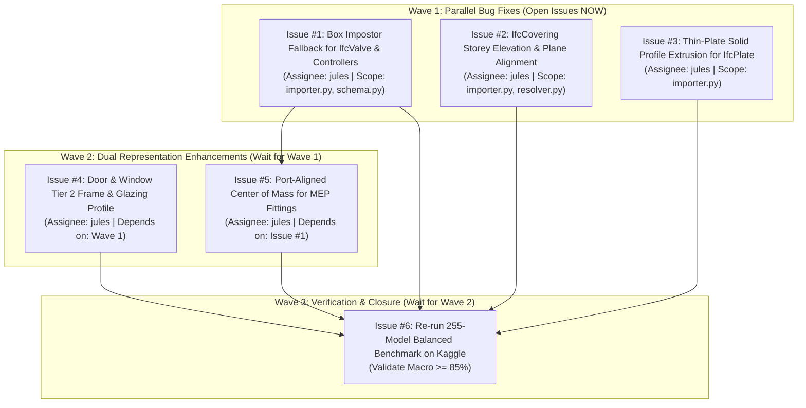

# 🗺️ debim Post-Benchmark Engineering Roadmap (Jules Task Breakdown)

Based on the 255-model balanced visual regression benchmark on Kaggle (`pridatakon/debim-3d-visual-balanced-benchmark`), this document defines the phased development plan to elevate debim's **Macro Average Visual Match from 70.6% to $\ge 85.0\%$**.

---

## 📊 Benchmark Baseline vs Target State

| System Domain | Baseline Accuracy | Failure Modes Identified | Target Accuracy | Wave |
|---|:---:|---|:---:|:---:|
| **🏗️ Structural (Column, Beam, Wall, Slab, Footing)** | **86.5%** | Production-ready (grade A). Needs regression protection. | $\ge 88.0\%$ | Baseline |
| **⚡ MEP Flow Segments (Pipes, Ducts, Cable Trays)** | **92.2%** | High accuracy. Minimal orientation issues. | $\ge 92.0\%$ | Baseline |
| **⚡ MEP Valves & Controllers (Valve, Damper, FlowCtrl)** | **0.0%** (235 items) | Missing 3D mesh generator in debim importer/resolver. | $\ge 80.0\%$ | **Wave 1** |
| **🏠 Architectural Coverings (Ceilings / Finishes)** | **5.8%** (122 items) | Storey elevation offset & planar normal misaligned. | $\ge 85.0\%$ | **Wave 1** |
| **🔩 Thin Steel Plates (`IfcPlate`, Parts)** | **22.7%** (62 items) | Thin extrusion thickness & axis orientation misaligned. | $\ge 80.0\%$ | **Wave 1** |
| **🚪 Architectural Openings (Doors & Windows)** | **68.8%** (502 items) | Simple opening box lacks sub-frame and glazing profile. | $\ge 85.0\%$ | **Wave 2** |
| **⚡ MEP Fittings (Pipe/Duct Elbows, Tees)** | **75.4%** (IoU: 38%) | Bounding box center-of-mass shifted from port axis. | $\ge 82.0\%$ (IoU 60%) | **Wave 2** |
| **⚖️ Overall Macro Match (Unweighted Class Mean)** | **70.6%** (Median: 80.9%) | Pull-down caused by 0% and 5% outlier categories. | **$\ge 85.0\%$** | **Wave 3** |

---

## 🌊 Execution Waves & Dependency Graph

---

## 🛠️ Detailed Task Specifications for Jules

### Wave 1: Immediate & Parallel (Open Issues Now)

#### Task 1.1: `fix(importer): Add Box Impostor Fallback for MEP Valves and Controllers`
- **Goal:** Resolve 0.0% match across 235 components (`IfcValve`, `IfcDamper`, `IfcFlowController`, `IfcDistributionControlElement`).
- **Files to Modify:**
  - `src/debim/importer.py`
  - `src/debim/schema.py`
  - `tests/test_mep_importer.py`
- **Implementation Requirements:**
  1. In `importer.py`, detect `IfcValve`, `IfcDamper`, `IfcFlowController`, and `IfcDistributionControlElement`.
  2. Extract 3D Axis-Aligned Bounding Box (AABB) using `ifcopenshell.geom.create_shape` or shape representations.
  3. Map them into `CustomElement` or dedicated `MEPValve` / `MEPDamper` in `mep.yaml` with explicit `dimensions: {width, depth, height}` and `center: [x, y, z]`.
  4. Ensure `tools/render_visual_regression.py`'s `extract_all_resolved_meshes` resolves them into 3D box meshes.
  5. Add unit tests in `tests/test_mep_importer.py`. All 121 existing tests must pass.

#### Task 1.2: `fix(importer): Fix IfcCovering Storey Elevation and Planar Normal Alignment`
- **Goal:** Resolve 5.8% match across 122 components (`IfcCovering` / Ceilings).
- **Files to Modify:**
  - `src/debim/importer.py`
  - `src/debim/resolver.py`
  - `tests/test_roof_covering_importer.py`
- **Implementation Requirements:**
  1. In `importer.py`, when parsing `IfcCovering`, extract the real relative elevation relative to the container storey rather than world 0.0.
  2. Compute polygon vertex normals; if pointing downward (ceiling), ensure polygon points are ordered consistently (counter-clockwise looking up).
  3. Ensure ceiling thickness defaults to at least 0.02m (20mm) if original thickness is zero or unspecified.
  4. Add unit test in `tests/test_roof_covering_importer.py`. All 121 existing tests must pass.

#### Task 1.3: `feat(importer): Add Thin-Plate Solid Profile Extrusion for IfcPlate and Parts`
- **Goal:** Elevate `IfcPlate` (22.7%) and `IfcBuildingElementPart` (34.2%).
- **Files to Modify:**
  - `src/debim/importer.py`
  - `tests/test_precision_importer.py`
- **Implementation Requirements:**
  1. In `importer.py`, support `IfcPlate` and `IfcBuildingElementPart` by reading their `IfcExtrudedAreaSolid` representation.
  2. Extract longitudinal length, cross-sectional plate thickness, and extrusion direction.
  3. Map them as structural plates with `polygon` + `thickness` or bounding extents.
  4. Add unit tests in `tests/test_precision_importer.py`. All 121 existing tests must pass.

---

### Wave 2: Dependent Tasks (DO NOT open issues until Wave 1 is completed)

#### Task 2.1: `feat(viewer): Implement Door & Window Sub-Frame and Glazing Dual Representation`
- **Dependency:** Wait for Wave 1 PRs to merge.
- **Goal:** Elevate `IfcDoor` (69.4%) and `IfcWindow` (68.2%) to $\ge 85.0\%$.
- **Files:** `src/debim/viewer.py`, `tools/render_visual_regression.py`.
- **Requirements:**
  1. Generate door/window 3D meshes with an outer 50mm frame box + recessed 10mm glass panel box.
  2. In `render_visual_regression.py`, include both frame and glass in the rendered composite mesh.

#### Task 2.2: `feat(mep): Implement Port-Aligned Center of Mass for Pipe & Duct Fittings`
- **Dependency:** Wait for Task 1.1 (`IfcValve` & Flow Controllers).
- **Goal:** Elevate fitting 3D IoU from 38% to $\ge 60\%$ and visual match from 75% to $\ge 82\%$.
- **Files:** `src/debim/importer.py`, `src/debim/resolver.py`.
- **Requirements:**
  1. For elbow/tee fittings, calculate the intersection point of connected distribution ports (`IfcDistributionPort`).
  2. Place the bounding box centroid at the port intersection rather than the geometric AABB center.

---

### Wave 3: Final Verification (DO NOT open issue until Wave 2 is completed)

#### Task 3.1: `test(benchmark): Re-run 255-Model Balanced Benchmark on Kaggle`
- **Dependency:** Wait for Wave 1 and Wave 2 PRs to merge into `main`.
- **Goal:** Re-run `pridatakon/debim-3d-visual-balanced-benchmark` and verify **Macro Average $\ge 85.0\%$**.
