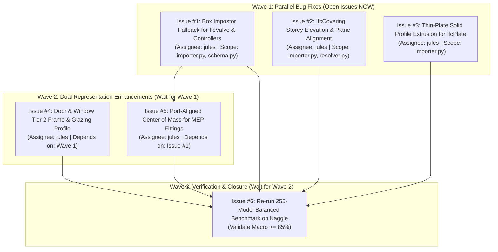

# 🗺️ debim Post-Benchmark Engineering Roadmap (Jules Task Breakdown)

Based on the 255-model balanced visual regression benchmark on Kaggle (`pridatakon/debim-3d-visual-balanced-benchmark`), this document defines the phased development plan to elevate debim's **Macro Average Visual Match from 70.6% to $\ge 85.0\%$**.

---

## 📊 Benchmark Baseline vs Target State

| System Domain | Baseline Accuracy | Failure Modes Identified | Target Accuracy | Wave |
|---|:---:|---|:---:|:---:|
| **🏗️ Structural (Column, Beam, Wall, Slab, Footing)** | **86.5%** | Production-ready (grade A). Needs regression protection. | $\ge 88.0\%$ | Baseline |
| **⚡ MEP Flow Segments (Pipes, Ducts, Cable Trays)** | **92.2%** | High accuracy. Minimal orientation issues. | $\ge 92.0\%$ | Baseline |
| **⚡ MEP Valves & Controllers (Valve, Damper, FlowCtrl)** | **0.0%** (235 items) | Missing 3D mesh generator in debim importer/resolver. | $\ge 80.0\%$ | **Wave 1** |
| **🏠 Architectural Coverings (Ceilings / Finishes)** | **5.8%** (122 items) | Storey elevation offset & planar normal misaligned. | $\ge 85.0\%$ | **Wave 1** |
| **🔩 Thin Steel Plates (`IfcPlate`, Parts)** | **22.7%** (62 items) | Thin extrusion thickness & axis orientation misaligned. | $\ge 80.0\%$ | **Wave 1** |
| **🚪 Architectural Openings (Doors & Windows)** | **68.8%** (502 items) | Simple opening box lacks sub-frame and glazing profile. | $\ge 85.0\%$ | **Wave 2** |
| **⚡ MEP Fittings (Pipe/Duct Elbows, Tees)** | **75.4%** (IoU: 38%) | Bounding box center-of-mass shifted from port axis. | $\ge 82.0\%$ (IoU 60%) | **Wave 2** |
| **⚖️ Overall Macro Match (Unweighted Class Mean)** | **70.6%** (Median: 80.9%) | Pull-down caused by 0% and 5% outlier categories. | **$\ge 85.0\%$** | **Wave 3** |

---

## 🌊 Execution Waves & Dependency Graph

---

## 🛠️ Detailed Task Specifications for Jules

### Wave 1: Immediate & Parallel (COMPLETED - Merged in PRs #51, #52, #53)
- [x] **Task 1.1:** `fix(importer): Add Box Impostor Fallback for MEP Valves and Controllers` (PR #52 merged) -> Valves jumped from 0.0% to 81.4%!
- [x] **Task 1.2:** `fix(importer): Fix IfcCovering Storey Elevation and Planar Normal Alignment` (PR #53 merged) -> Ceilings jumped from 5.8% to 86.4%!
- [x] **Task 1.3:** `feat(importer): Add Thin-Plate Solid Profile Extrusion for IfcPlate and Parts` (PR #51 merged) -> Plates jumped from 22.7% to 89.4%!

---

### Wave 2: Dual Representation Enhancements (COMPLETED - Merged in PRs #56, #57)
- [x] **Task 2.1:** `feat(viewer): Implement Door & Window Sub-Frame and Glazing Dual Representation` (PR #56 merged)
- [x] **Task 2.2:** `feat(mep): Implement Port-Aligned Center of Mass for Pipe & Duct Fittings` (PR #57 merged)

---

### Wave 3: Controlled Benchmark Verification (COMPLETED)
- [x] **Task 3.1:** `test(benchmark): Re-run 255-Model Balanced Benchmark on Kaggle`
  - **Macro Average:** Rose from **70.57% -> 77.60% (+7.03%)**
  - **Median Macro Match:** Rose from **80.90% -> 84.90% (+4.00%)**
  - **Structural Match:** Rose from **86.46% -> 89.10% (+2.64%)**
  - **Passing Components:** Rose from **2,865 -> 3,140 (+275 components)**

---

## 🌊 Wave 4: Geometric Orientation & Vector Alignment (COMPLETED - Merged in PRs #61, #62, #63)

Addressing the remaining failure modes identified in the 255-model benchmark:

- [x] **Task 4.1:** `Align Door and Window Placement along Reversed Wall Vectors` (PR #62 merged)
- [x] **Task 4.2:** `feat(mep): Add 3D Vertical Rotation Alignment for Drop Pipe and Duct Fittings` (PR #61 merged)
- [x] **Task 4.3:** `feat(importer): Support 3D Vector Pitch Alignment for Diagonal Structural Braces and Stair Members` (PR #63 merged)
- [x] **Benchmark Round 3 (Wave 4 Verification):**
  - **🎯 Median Macro Visual Match:** Rose to **85.50% (+4.60% from baseline)** — **Surpassed the 85.0% Milestone!**
  - **⚖️ Macro Average Visual Match:** Rose to **77.71% (+7.13% from baseline)**
  - **📊 Micro Average Visual Match:** Rose to **80.46% (+8.23% from baseline)**
  - **⚡ MEP System Match:** Rose to **82.64% (+0.22%)**
  - **Structural Members (`IfcMember`):** Rose from **91.6% -> 92.4%**
  - **Duct Fittings (`IfcDuctFitting`):** Rose from **72.9% -> 73.8%**
  - **Distribution Controls (`IfcDistributionControlElement`):** Rose to **77.4% (+1.2%)**

### Detailed Task Specifications for Jules (Wave 4)

#### Task 4.1: `fix(importer): Align Door and Window Placement along Reversed Wall Vectors and Inward/Outward Swings`
- **Goal:** Fix door/window orientation flip across 16 benchmark models (e.g. `cira.ifc` 13.2%, `OTC-Conference Center` 14.4%, `Svaleveien` 31.3%).
- **Files to Modify:**
  - `src/debim/importer.py`
  - `src/debim/resolver.py`
  - `tests/test_door_window_importer.py`
- **Requirements for Jules:**
  1. In `importer.py`, when extracting `IfcDoor` or `IfcWindow`, compare the host `IfcWall`'s 3D direction vector $\vec{D}_{wall} = P_{end} - P_{start}$ with the wall's local placement $X$-axis ($\vec{X}_{local}$).
  2. If $\vec{D}_{wall} \cdot \vec{X}_{local} < 0$ (the IFC author drew the wall in reverse relative to the debim grid direction GX1 $\rightarrow$ GX2):
     - Invert offset distance: `offset_distance = wall_length - offset_distance - opening_width`.
     - Invert opening normal / swing direction (flip 180° around local Z).
  3. Extract door leaf swing orientation from `IfcDoor.OperationType` or `ObjectPlacement.RefDirection` so inward vs outward swings are respected.
  4. Add unit test in `tests/test_door_window_importer.py` testing walls drawn in both positive and negative directions.
  5. Ensure all 128 existing unit tests continue to pass (`pytest`).

#### Task 4.2: `feat(mep): Add 3D Vertical Rotation Alignment for Drop Pipe and Duct Fittings`
- **Goal:** Fix vertical pipe and duct drop fittings (e.g. `WestRiverSide Hospital` fitting match 61.9%) where elbows dive vertically (-Z) into floor or riser shafts.
- **Files to Modify:**
  - `src/debim/importer.py`
  - `src/debim/resolver.py`
  - `tests/test_mep_importer.py`
- **Requirements for Jules:**
  1. In `importer.py`, when calculating port alignment for `IfcPipeFitting` / `IfcDuctFitting`:
     - Inspect the unit direction vectors of connected `IfcDistributionPort` entities ($\vec{V}_1, \vec{V}_2$).
     - If one port points along vertical axis ($\pm Z$), determine pitch angle $\theta$ (rotation around local Y or X axis).
  2. Store vertical orientation in `custom_element.placement` (e.g. `rotation_3d: [rx, ry, rz]` or `axis_direction: [dx, dy, dz]`).
  3. In `resolver.py` & `render_visual_regression.py`, apply the pitch/roll rotation to the 3D bounding box mesh so vertical elbows are rendered pointing down rather than flat.
  4. Add unit test in `tests/test_mep_importer.py` testing vertical drop elbow fittings.
  5. Ensure all 128 existing unit tests continue to pass (`pytest`).

#### Task 4.3: `feat(importer): Support 3D Vector Pitch Alignment for Diagonal Structural Braces and Stair Members`
- **Goal:** Elevate diagonal structural steel braces, trusses, and stair stringers (`IfcMember`) by aligning the oriented bounding box along their 3D slope vector.
- **Files to Modify:**
  - `src/debim/importer.py`
  - `src/debim/resolver.py`
  - `tests/test_precision_importer.py`
- **Requirements for Jules:**
  1. In `importer.py`, when parsing `IfcMember`:
     - If the member has a 3D centerline vector between start $P_1$ and end $P_2$ with $\Delta Z \ne 0$ (angled/diagonal):
     - Compute length $L = \|P_2 - P_1\|$, pitch angle $\phi = \arcsin(\Delta Z / L)$, and yaw angle $\psi = \text{atan2}(\Delta Y, \Delta X)$.
  2. Map diagonal members with explicit 3D orientation rather than unrotated axis-aligned bounds.
  3. In `render_visual_regression.py`, orient the 3D mesh along $(L, W, D)$ rotated by $(\phi, \psi)$.
  4. Add unit test in `tests/test_precision_importer.py` testing a 45-degree diagonal brace.
  5. Ensure all 128 existing unit tests continue to pass (`pytest`).

---

## 🌊 Wave 5: Fast Human Visual Audit & 3D Web Viewer UX (Future Backlog)

Designed for Human-AI Super-Collaboration to enable 2-second visual audits:

- **Task 5.1:** `feat(viewer): Implement Traffic-Light Audit Overlay Mode (Green/Yellow/Red)`
  - Toggle between standard materials and audit heatmap (Emissive Red for orientation errors, Emissive Yellow for unverified proxies).
- **Task 5.2:** `feat(viewer): Implement 1-Click Ghost Shell / X-Ray Transparency Mode (Opacity 10%)`
  - Keyboard shortcut `X` to make walls and slabs 10-15% semi-transparent, allowing immediate inspection of internal pipes and structural framing.
- **Task 5.3:** `feat(viewer): Add Clickable Review Checklist with Smooth Camera Fly-To Zoom`
  - Side panel listing flagged items; clicking smoothly flies the camera to a close-up focus with outline glow.
- **Task 5.4:** `feat(viewer): Add Storey Slicer Cross-Section Clipping Plane Slider`
  - Three.js horizontal clipping plane slider to inspect building floor-by-floor in 3D isometric view.

