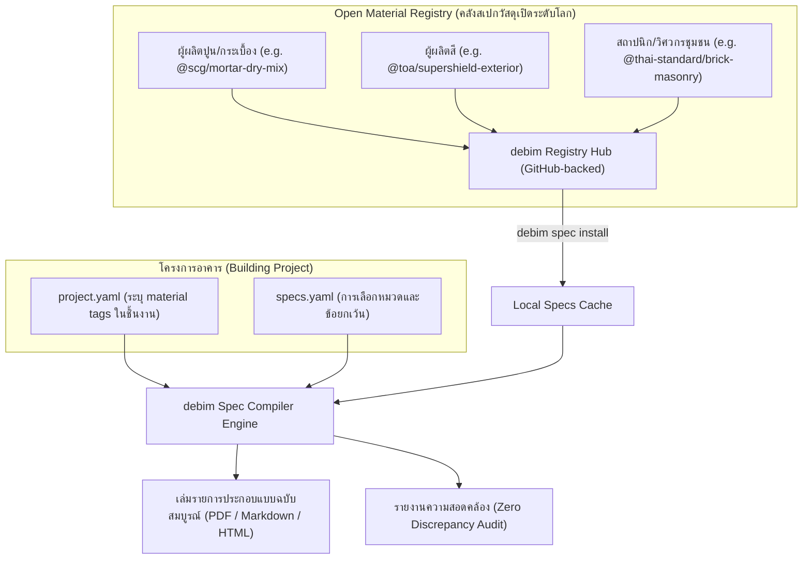

# ROADMAP_SPECS_BOOK.md — Declarative Specification Engine & Open Material Registry

> **"Architectural Specifications as Code: From Tedious Copy-Paste to Global Open Registry."**  
> เอกสารข้อกำหนดสถาปัตยกรรมระบบการสร้าง **"เล่มรายการประกอบแบบก่อสร้าง (Architectural Specification Book)"** แบบอัตโนมัติจากโมเดลอาคาร และระบบคลังสเปกวัสดุแบบเปิด (Open Material Registry / Package Manager) ที่เปิดให้ผู้ผลิตวัสดุทั่วโลกเข้ามาร่วมแชร์ข้อมูล

---

## 😫 1. The Core Pain Point (ปัญหาที่สถาปนิกเกลียดที่สุด)

ในวงการก่อสร้าง **"เล่มรายการประกอบแบบ (General & Specific Specifications)"** คือเอกสารหนา 100–300 หน้า ที่ระบุมาตรฐานวัสดุ, วิธีการติดตั้ง, การทดสอบ, และการรับประกัน:
1. **งาน Copy-Paste สุดน่าเบื่อ:** สถาปนิกมักเปิด Word โปรเจกต์เก่ามาก๊อปปี้แปะ ทำให้เกิดข้อผิดพลาดร้ายแรง เช่น ลืมเปลี่ยนชื่อโครงการ หรือในแบบระบุอิฐมวลเบา แต่ในเล่มสเปกดันเขียนอิฐมอญ (Discrepancy ระหว่างแบบกับเล่มสเปก)
2. **ผู้ผลิตวัสดุ (Manufacturers) อยากขาย แต่ไม่มีช่องทางลงสเปกมาตรฐาน:** ผู้ผลิตสี, ฉนวน, กระเบื้อง, ประตูหน้าต่าง มีคู่มือการติดตั้ง (Application Data Sheet) ยิบย่อย แต่ไม่มีวิธีมาตรฐานในการส่งให้สถาปนิกดึงไปใส่ในแบบได้ใน 1 วินาที
3. **ความไม่เชื่อมโยงกับโมเดล (No Single Source of Truth):** ถ้าใน `project.yaml` มีการเปลี่ยนสเปกกระจกจาก Low-E 6mm เป็น Double Glazing 24mm สถาปนิกต้องมานั่งเปิดแก้เล่มสเปกด้วยมืออีกรอบ

---

## 🏛️ 2. The Solution: "Specs-as-Code" + "Open Material Registry" (NPM of Materials)



---

## 📦 3. Open Material Registry: รูปแบบแพ็กเกจสเปกวัสดุ (Material Package Spec)

ผู้ผลิตวัสดุหรือสถาปนิก สามารถเขียนสเปกวัสดุของตัวเองในรูปแบบ **Markdown + YAML Frontmatter** แล้วแชร์ขึ้น GitHub หรือ Registry:

```yaml
# ===================================================
# packages/toa/supershield-exterior/spec.md
# ===================================================
---
id: "paint-acrylic-exterior-premium"
name: "สีน้ำอะคริลิกแท้ 100% ชนิดกึ่งเงา สำหรับภายนอก"
manufacturer: "TOA Paint (Thailand)"
standards:
  astm: ["ASTM D2486", "ASTM D4541"]
  tis: ["มอก. 2321-2564 (สีอิมัลชันทนสภาวะอากาศ)"]
masterformat: "09 91 13 - Exterior Painting"
warranty_years: 15
---

### 1. คุณสมบัติทั่วไป (General Properties)
- ฟิล์มสีมีความทนทานต่อรังสี UV และสภาวะอากาศร้อนชื้นด้วยเทคโนโลยี Titanium Triple Protection
- มีค่าการสะท้อนความร้อนจากแสงอาทิตย์ (TSR) ไม่น้อยกว่า 96.7%

### 2. การเตรียมพื้นผิว (Surface Preparation)
1. พื้นผิวปูนฉาบใหม่ต้องทิ้งให้แห้งสนิทอย่างน้อย 28 วัน ความชื้นไม่เกิน 14% และค่าความเป็นด่าง (pH) ไม่เกิน 8
2. ทำความสะอาดพื้นผิวให้ปราศจากฝุ่น ผงซีเมนต์ คราบไข และเศษสิ่งสกปรก

### 3. ระบบการทาสี (Application System)
- **สีรองพื้น:** ทาสีรองพื้นปูนใหม่กันด่าง จำนวน 1 เที่ยว ทิ้งให้แห้งอย่างน้อย 2 ชั่วโมง
- **สีทับหน้า:** ทาสีทับหน้าอะคริลิกภายนอก จำนวน 2 เที่ยว แต่ละเที่ยวทิ้งให้แห้งอย่างน้อย 2 ชั่วโมง
```

---

## 📑 4. การผูกโยงกับ `project.yaml` (Zero Discrepancy)

ในโมเดลอาคาร ชิ้นส่วนผนัง ประตู หรือพื้น จะอ้างอิงรหัสสเปกโดยตรง:

```yaml
# project.yaml
walls:
  - id: "wall_facade_north"
    type: "exterior"
    finish: "paint-acrylic-exterior-premium" # ชี้ไปที่สเปกของผู้ผลิต
```

เมื่อสั่งคอมไพล์เล่มสเปก:
1. **Auto-Discovery:** ตัวคอมไพเลอร์ของ debim จะสแกน `project.yaml` ว่าอาคารหลังนี้ใช้วัสดุอะไรบ้าง
2. **Dependency Resolution:** ดึงเฉพาะข้อกำหนดของวัสดุที่ **มีอยู่ในอาคารจริงๆ** มาจัดทำเล่มรายการประกอบแบบ
   - *ไม่ต้องมีสเปกกระเบื้องยาง ถ้าอาคารหลังนั้นไม่ได้ปูกระเบื้องยางเลย!*
3. **Automated MasterFormat / UniFormat Indexing:** เรียงลำดับบทตามมาตรฐานวิชาชีพ เช่น:
   - หมวด 03: งานคอนกรีต (Concrete)
   - หมวด 04: งานก่ออิฐ (Masonry)
   - หมวด 07: งานกันซึมและฉนวน (Thermal & Moisture Protection)
   - หมวด 09: งานตกแต่งผิว (Finishes - สี, กระเบื้อง, ฝ้า)

---

## 🤝 5. Community & Manufacturer Incentives (ทำไมคนและผู้ผลิตถึงจะช่วยกันแชร์?)

1. **สำหรับผู้ผลิตวัสดุ (SCG, TOA, Saint-Gobain, TPI ฯลฯ):**
   - **ได้ยอดขาย (Sales Pipeline):** เมื่อผู้ผลิตแชร์สเปกขึ้น debim Registry สถาปนิกและ AI จะเลือกสเปกนั้นไปใส่ในโครงการได้ง่ายที่สุด ทำให้ชื่อแบรนด์ของผู้ผลิตถูกบรรจุลงในเล่มสเปกประกวดราคาประมูลงานก่อสร้างทันที
   - ผู้ผลิตสามารถ Verified เจ้าของแพ็กเกจ (มีตราติ๊กถูกทอง) เพื่อยืนยันว่าเป็นสเปกทางการจากโรงงาน
2. **สำหรับสถาปนิกและวิศวกรชุมชน:**
   - ได้ชุดสเปกมาตรฐานกลาง (เช่น สเปกงานก่อสร้างราชการ กรมบัญชีกลาง, สเปก วสท., สเปกสมาคมสถาปนิกสยาม) ที่ถูกต้องตามกฎหมาย ไม่ต้องพิมพ์ใหม่ซ้ำซาก
3. **สำหรับ AI Architectural Copilot:**
   - เมื่อสถาปนิกสั่ง AI: *"ขอสเปกสีทาภายนอกกันเชื้อรา รับประกัน 10 ปีขึ้นไป"*
   - AI แค่ค้นหา Registry แล้วดึงแพ็กเกจที่ตรงตามเงื่อนไขมาผูกกับ `project.yaml` จบงานได้ใน 2 วินาที

---

## 🛠️ 6. CLI Command Surface

```bash
# ค้นหาแพ็กเกจสเปกวัสดุจาก Registry
debim spec search "exterior paint"

# ดาวน์โหลดและติดตั้งแพ็กเกจสเปกวัสดุเข้าโปรเจกต์
debim spec add @toa/supershield-exterior

# ตรวจสอบความสอดคล้องระหว่างโมเดล 3D กับเล่มสเปก (Discrepancy Check)
debim spec audit -m project.yaml

# คอมไพล์เล่มรายการประกอบแบบทั้งเล่มออกมาเป็น PDF หรือ Markdown สวยงาม
debim spec build -m project.yaml -o dist/specifications_book.pdf
```
