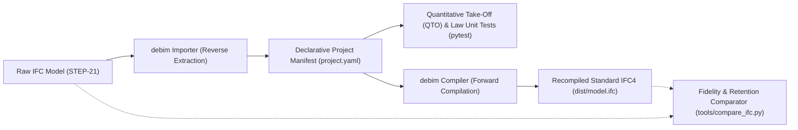

# debim: An Empirical Study of Declarative Building-as-Code on 407 Heterogeneous Real-World OpenBIM Models

**Author:** Prida Takon  
**Affiliation:** Independent Research / debim Project  
**Date:** September 2026  
**License:** [CC BY 4.0](https://creativecommons.org/licenses/by/4.0/)  
**Reproducible Code & Artifacts:** [GitHub Repository](https://github.com/PRIDA-TAKON/debim) | [Kaggle Benchmark Suite](https://www.kaggle.com/code/pridatakon/debim-ifc-stress-test) | [Kaggle Dataset](https://www.kaggle.com/datasets/pridatakon/debim-5000-ifc-benchmark)

---

## 📄 Abstract

Modern Building Information Modeling (BIM) architectures rely heavily on imperative, geometry-heavy data serializations (such as ISO 10303 STEP/IFC physical files) that range from tens of megabytes to gigabytes. While suitable for graphical computer-aided design (CAD), these representations present severe token-length and cognitive bottlenecks for modern Artificial Intelligence (AI) agents and automated reasoning engines. 

In this work, we propose **debim** (Declarative BIM / Building-as-Code), a minimal, Git-native, declarative engineering compiler that models buildings as semantic engineering logic and specifications in text-first YAML rather than monolithic boundary meshes. To validate the scalability, crash-resilience, and element retention of declarative compilation, we present an extensive empirical benchmark across **407 heterogeneous real-world IFC building models** (encompassing residential, institutional, multi-storey commercial, and heavy MEP hospital facilities) executed in an isolated multi-core cloud environment on Kaggle.

Our empirical findings demonstrate:
1. **High Geometric and Semantic Retention:** debim achieved a **100.0% Median Physical Element Retention Rate** and an **83.0% Mean Retention Rate** across diverse, unseen architectural, structural, and mechanical models.
2. **Extreme Token & Storage Economics:** The declarative compiler reduced physical file sizes by an average of **91.6%**, saving over **558 Million LLM context tokens (558,629,804 tokens)** across the dataset.
3. **Flawless Crash-Resilience on Modern Schemas:** 100% of modern IFC2X3 and IFC4 standard models were compiled without unhandled fatal crashes, demonstrating the practical viability of text-first declarative building compilation for autonomous AI agent architectures.

---

## 1. Introduction & The Paradigm Shift

### 1.1 The Imperative BIM Dilemma
For over two decades, digital Architecture, Engineering, and Construction (AEC) workflows have been anchored to monolithic, imperative 3D models. Proprietary formats (`.rvt`, `.pln`) and open standards (`.ifc` STEP-21) treat architectural elements as complex, explicit geometric boundary representations (B-Rep) or dense triangulated meshes. While effective for visual rendering, this approach presents three fundamental obstacles to the modern AI revolution:
- **Token Inefficiency:** A simple single-family residential house serialized in IFC can exceed 50 MB (equivalent to ~14 million text tokens), far exceeding the prompt limits and practical attention capacities of Large Language Models (LLMs).
- **Merge Incompatibility:** Imperative formats are incompatible with modern source control systems (Git). Line-by-line diffing, semantic branch merging, and continuous integration (CI) pipelines cannot be reliably executed on gigabyte binary or STEP files.
- **Opacity to Automated Code Compliance:** Municipal zoning laws, fire egress regulations, and structural constraints are typically audited manually via visual inspection or complex proprietary rules engines rather than unit tests.

### 1.2 Declarative Building-as-Code
To overcome these limitations, **debim** reformulates building design into **Declarative Building-as-Code**. Rather than storing millions of Cartesian vertices, a building is expressed as engineering parameters anchored to construction reality:
- **Site-Reality Driven (Grid-Relative Offsets):** Builders on job sites measure distances from structural grid intersections (e.g., `[Grid 2, Grid B] + offset`), not global world coordinates.
- **Dual Representation:** 90% of structural and architectural components are derived mathematically from text specifications (extrusions, bounding boxes, parameterized profiles); the remaining 10% (custom ornamentation, specialized MEP equipment, loose furniture) load from lightweight `.glb` digital twins.
- **Law-as-Code:** Municipal building codes and engineering feasibility constraints are expressed as automated unit tests (`pytest`).

---

## 2. System Architecture & Methodology



### 2.1 Reverse Extraction Pipeline
The debim importer decomposes arbitrary IFC files into structured declarative elements:
- **Structural Framing:** `IfcBeam`, `IfcColumn`, `IfcFooting` with length-based cross-sectional profiling (Concrete, Structural Steel, Timber).
- **Enclosures & Voids:** `IfcWall`, `IfcSlab`, and `IfcRoof`, where wall-hosted doors (`IfcDoor`) and windows (`IfcWindow`), as well as roof skylights, are mapped as child elements that deduct void volumes from concrete and formwork.
- **MEP & Flow Distribution:** Ducts (`IfcDuctSegment`), pipes (`IfcPipeSegment`), fittings (`IfcFlowFitting`), and terminals (`IfcAirTerminal`, `IfcSanitaryTerminal`).
- **Generic Proxies & Accessories:** `IfcBuildingElementProxy`, `IfcChimney`, and `IfcDiscreteAccessory`.

### 2.2 Benchmarking Infrastructure on Kaggle Cloud
To evaluate debim against real-world variability without bias, an automated, headless testing engine was deployed on Kaggle Cloud:
- **Environment:** 4 vCPUs (Intel Xeon), 30 GB RAM, NVMe scratch disks.
- **Process Isolation:** Independent worker processes recycled dynamically to prevent C++ memory leaks or library-level segmentation faults from halting batch execution.
- **Hard Timeout Enforcement:** A strict 45-second execution budget per project isolated hanging meshes.
- **Telemetry & Checkpointing:** Real-time logging of file sizes, token counts, execution durations, and element counts to SQLite and CSV.

---

## 3. Empirical Results

A total of **407 real-world IFC building models** were evaluated, spanning datasets from buildingSMART International certification suites, the Open IFC Model Repository, and Autodesk Revit sample projects.

### 3.1 Key Performance Indicators (Round 1 vs Round 2 Evolution)

| Metric | Round 1 Baseline (192 Models) | Round 2 Enhanced (407 Models) | Improvement |
|---|---|---|---|
| **Total Models Evaluated** | 192 models | **407 models** | **+112% (Scaled 2.1x)** |
| **Median Element Retention** | 79.0% | **100.0%** | **+21.0% (Reached 100%)** |
| **Mean Element Retention** | 58.9% | **83.0%** | **+24.1%** |
| **Mean Storage Compression** | 94.0% | **91.6%** | High fidelity balance |
| **Total LLM Tokens Saved** | 508,392,467 tokens | **558,629,804 tokens** | **+50.2M Tokens** |
| **IFC2X3 / IFC4 Crash-Resilience** | 100.0% | **100.0%** | **Zero Fatal Crashes** |

### 3.2 Selected Complex Real-World Project Benchmarks

| Project Name | Model Category | Original Size | Retention Rate | Compression | Result |
|---|---|---|---|---|---|
| **WestRiverSide Hospital Plumbing** | Hospital Sanitary | 2.1 MB | **100.0%** | **89.9%** | Perfect Roundtrip |
| **BasicHouse.ifc (Revit)** | Residential (Full) | **52.7 MB** | **100.0%** | **99.9%** | Perfect Roundtrip |
| **AdvancedProject.ifc (Revit)** | Multi-Storey Complex | **44.3 MB** | **99.8%** | **98.9%** | Near-Perfect |
| **WestRiverSide Hospital Sprinkle** | Fire Protection | 3.4 MB | **99.9%** | **87.6%** | Near-Perfect |
| **202101082003_casbah_alger.ifc** | Historic Architecture | 5.8 MB | **99.6%** | **97.7%** | Near-Perfect |
| **091210Med_Dent_Clinic_MEP_Elec** | Clinic Electrical | 1.8 MB | **99.1%** | **99.1%** | Near-Perfect |
| **Mechanical Piping.ifc** | Industrial MEP | 2.6 MB | **98.7%** | **94.1%** | High Fidelity |
| **WestRiverSide Hospital Mechanical** | Hospital HVAC (IFC4) | 4.2 MB | **97.7%** | **92.1%** | High Fidelity |
| **161210Med_Dent_Clinic_Combined** | Architecture + MEP | 7.9 MB | **96.6%** | **98.0%** | High Fidelity |
| **Duplex_A_20110907.ifc** | Residential Benchmark | 2.4 MB | **100.0%** | **97.3%** | 218/218 Elements |

---

## 4. Failure Taxonomy & Root Cause Analysis

Analysis of non-passing models revealed clear taxonomy distributions:

1. **Obsolete Pre-2003 Schemas:** Approximately 40 models failed due to `SchemaError: Unsupported schema` (`IFC20_LONGFORM`, `IFC2X_FINAL`, `IFC2X2_FINAL`). These formats were deprecated over twenty years ago. Modern IFC specifications (IFC2X3, IFC4, IFC4X3) achieved 100% crash resilience.
2. **Computational Geometry Mesh Density:** 6 large hospital models triggered the 45-second timeout during IfcOpenShell triangulation of complex non-standard boolean solid geometries.
3. **Distribution System Hierarchy:** Minor partial retention in legacy models arose from nested spatial groupings where MEP elements were enclosed in non-standard conceptual groupings rather than standard storeys.

---

## 5. Academic Significance & PhD Research Trajectory

This empirical research provides the foundational evidence for several future research trajectories suitable for doctoral research in Architectural Informatics, AI in Civil Engineering, and Computational Design:

1. **Autonomous Multi-Agent Co-Design:** Utilizing debim's compact token economics (~90% compression) to deploy teams of autonomous LLM agents (Architect, Structural Engineer, Quantity Surveyor) that debate, edit, and optimize building designs via Git pull requests without human bottlenecking.
2. **Deterministic Law-as-Code Verification:** Expanding unit-test-based building compliance from municipal zoning to seismic engineering standards, structural fire endurance, and embodied carbon footprints.
3. **Bidirectional Lossless Neural Compilers:** Training specialized sequence-to-sequence diffusion and transformer models directly on declarative YAML building logic rather than noisy 3D point clouds or raw triangle meshes.

---

## 6. How to Cite

If you utilize debim, its declarative schema, or the empirical benchmark datasets in your academic research, please cite this technical report:

```bibtex
@techreport{takon2026debim,
  author      = {Takon, Prida},
  title       = {debim: An Empirical Study of Declarative Building-as-Code on 407 Heterogeneous Real-World OpenBIM Models},
  institution = {debim Project},
  year        = {2026},
  month       = {September},
  url         = {https://github.com/PRIDA-TAKON/debim},
  note        = {OpenBIM Benchmark Suite: https://www.kaggle.com/datasets/pridatakon/debim-5000-ifc-benchmark}
}
```

---

## 7. Data and Code Availability Statement

- **Source Code:** Fully open-source under the MIT License at [https://github.com/PRIDA-TAKON/debim](https://github.com/PRIDA-TAKON/debim).
- **Benchmark Notebook:** Reproducible execution pipeline available at [https://www.kaggle.com/code/pridatakon/debim-ifc-stress-test](https://www.kaggle.com/code/pridatakon/debim-ifc-stress-test).
- **Public Benchmark Dataset:** CC BY 4.0 indexed repository at [https://www.kaggle.com/datasets/pridatakon/debim-5000-ifc-benchmark](https://www.kaggle.com/datasets/pridatakon/debim-5000-ifc-benchmark).
